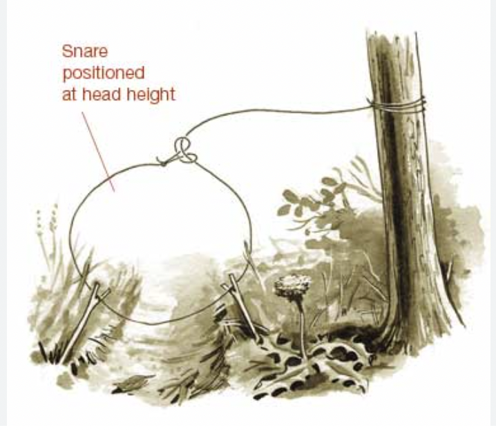

# IELTS

- **devote**
    
    *verb*
    
    dedicate
    
    DO NOT GET CONFUSED WITH “devoid”
    
    “**I want to devote more time to my family.”**
    
- **devoid**
    
    *adjective*
    
    not having any of; lack of
    
    “**He is pretty good at studying but is completely devoid of humor.”**
    
- **cognitive**
    
    *adjective*
    
    involving conscious intellectual activity or reasoning
    
    “**Exercising in the gym requires cognitive thinking as well.”**
    
- **twine**
    
    *verb*
    
    cause to wind around something. 
    
    “**The thorn twined around the grave of Barbara Allen.”**
    
- **impending / imminent**
    
    **impending**
    
    *adjective*
    
    happening very soon; **forthcoming** (usually associated with negative)
    
    “**There is an impending chaos in the colony.”**
    
    **imminent**
    
    *adjective*
    
    about to happen (associated with neutral) (Using *imminent* stresses the immediacy of the future event)
    
    **“imminent financial crisis”**
    
- **foe**
    
    *noun*
    
    An enemy.
    
    **“We should treat our friends and foes differently.”**
    
- **endurance**
    
    *noun*
    
    ability or stamina to handle difficult things.
    
    “T**he Navy tests everyone's endurance from the start.”**
    
- **perseverance**
    
    *noun*
    
    Continue to do something even if it is difficult.
    
    “**His perseverance in exam preparation finally paid off.”**
    
- **resilient**
    
    *adjective*
    
    Able to recover from an adversity.
    
    “**Babies are far more resilient than we realize.”**
    
- **adversity**
    
    *noun*
    
    A difficult or unpleasant situation or condition.
    
    synonym: **misery; misfortune; hardship**
    
    “**Society is in an adversity after the explosion.”**
    
- **indifference**
    
    *noun*
    
    Lack of enthusiasm or interest or concern
    
    synonym: **apathy**
    
    “**In an effort to fight indifference, the principal announced new guidelines in the school.”**
    
- **apathy**
    
    *noun*
    
    Lacking enthusiasm, interest or emotion
    
    synonym: **indifference**
    
    “**The apathy in students led the principal to impose various new policies on the school.”**
    
- **subsidize**
    
    *verb*
    
    support financially.
    
    “**The government finally started subsidizing small businesses.”**
    
- **pernicious**
    
    *adjective*
    
    having a harmful effect, especially in a gradual way.
    
    synonym: **detrimental**
    
    “**Consuming alcohol has a very high pernicious effect on human health.”**
    
- **affluent**
    
    *adjective*
    
    wealthy; having an abundant supply of money.
    
    “**Stress in kids are concerning factor in this affluent society.”**
    
- **palatable**
    
    *adjective*
    
    Acceptable to the taste or mind or notion
    
    “**People love having extremely palatable foods.”**
    
    **”He came up with a palatable solution pretty quickly.”**
    
- **superimpose**
    
    *verb*
    
    Place them on top of one another (do not get confused with **juxtapose**)
    
    “**The idea of dopamine gratification when watching pornography also can be superimposed on drugs, foods, etc as well.”**
    
- **gratify**
    
    *verb*
    
    make happy or satisfied.
    
    “**These days men are struggling to gratify their spouses.”**
    
- **innate**
    
    *adjective*
    
    Being talented through inherited qualities.
    
    “**Humans have different innate desires that make them able to survive in society.”**
    
- **enunciate**
    
    *verb*
    
    Say (a word or a phrase) in a certain way; pronounce clearly
    
    “**She enunciates French in a funny way.”**
    
- **persuade**
    
    *verb*
    
    Make someone do something through reasoning or argument.
    
    “**You can't just persuade me to buy everything that you want.”**
    
- **substrata(substratum)**
    
    *noun*
    
    a base or foundation of something**.**
    
    **“Most people tend to use tiny substrata to offend anyone.”**
    
- **precarious**
    
    *adjective*
    
    not securely held or in position; dangerously likely to fall or collapse.
    
    **“precarious ladder”**
    
    **“the cup is held in a precarious position”**
    
- **banal**
    
    *adjective*
    
    boring due to lack or originality or repeated too often.
    
    **“His writings are banal.”**
    
- **detest**
    
    *verb*
    
    intense dislike*.*
    
    synonym: **loathe**
    
    “**I would never support the radical changes in politics that I detest.”**
    
- **aversion**
    
    *noun*
    
    a feeling of detest.
    
    “**Dopamine plays an important role in an aversion as well.”**
    
- **inevitable**
    
    *adjective*
    
    Cannot be avoided or prevented; unavoidable
    
    “**There's no getting around from tomorrow's inevitable exam results.”**
    
- **trivial**
    
    adjective
    
    Small and of little importance
    
    synonym: **petty**
    
    “**The trivial sum of money that she saved was not enough for her study.”**
    
- **adhere**
    
    *verb*
    
    stuck to; put in place.
    
    “**I don't like being adhered to a stressful job.”**
    
- **rationale**
    
    *noun*
    
    justification or reasoning of something.
    
    “**The police were not able to provide the rationale behind their actions.”**
    
    **“What was your rationale behind such harrowing act?”**
    
- **rational**
    
    *adjective*
    
    consistent with; based on; using reason. 
    
    antonym: **irrational**
    
    “**His immediate action to remove the worker was rational.”**
    
    **“Kids these days have irrational views about privacy and safety.”**
    
- **pitter-patter**
    
    *noun*
    
    Rain gently (*sim-sime pani*)
    
    “**I really like the pitter-patter sound of the rain.”**
    
- **torrential**
    
    *adjective*
    
    very heavy rain (usually associated with rain)
    
    “**I really don't prefer torrential rain though.”**
    
- **seldom**
    
    *adverb*
    
    rarely; not often*.*
    
    “**North Korea is seldom visited by tourists.”**
    
- **fortify**
    
    *verb*
    
    Make more stronger.
    
    synonym: **bolster**
    
    “**Fortify your mind and start grinding to climb up the ladder in life.”**
    
- **mortify**
    
    *verb*
    
    to make someone very embarrassed (do not get confused with **petrify**)
    
    **“He was no longer mortified by his past criminal activities.”**
    
- **petrified**
    
    *verb*
    
    terrified
    
    🧠 Remember Chandler’s line from Friends = **“First i was afraid, I was petrified”**
    
    “**The baby was petrified when the dog went near to him.”**
    
- **apparent**
    
    *adjective*
    
    clearly understood or visible*.*
    
    antonym: **obscure; amorphous**
    
    **“No one knows the apparent reason why he left his money at home.”**
    
    “**He left the studio with obscure writing in his notes.”**
    
- **impartial**
    
    *adjective*
    
    unbiased
    
    “**It is important for jurors to be impartial before reaching a verdict.”**
    
- **mundane**
    
    adjective
    
    Ordinary & boring.
    
    “**His speech was mundane.”**
    
- **analogous**
    
    *adjective*
    
    similar in some respects but otherwise different
    
    “**They saw the relationship between the new ruler and his policies as analogous to his father.”**
    
- **strive**
    
    *verb*
    
    try very hard to achieve something. (*do not get confused with “strife”*)
    
    “**Everyday, he strives to get better at programming.”**
    
- **endeavor**
    
    *noun*
    
    a strenuous effort; attempt.
    
    “**I wish you all the best for your future endeavors.”**
    
    ---
    
    *verb*
    
    try very hard to achieve something.
    
    **“We must constantly endeavor if we are to succeed.”**
    
- **strenuous**
    
    *adjective*
    
    tough
    
    synonym: **arduous, grueling, onerous**
    
    “**We had a very strenuous exam yesterday.”**
    
- **leeway**
    
    *noun*
    
    the flexibility of action; the amount of freedom to move or act.
    
    “**The teachers don't have that much of a leeway when it comes to teaching.”**
    
- **elicit**
    
    *verb*
    
    Bring out or draw; evoke; extract (feelings, responses, emotions)
    
    “**to elicit a solution.”**
    
    **”to elicit the truth.”** 
    
    **”The police officer tried to elicit the truth from the suspects.”**
    
- **illicit**
    
    *adjective*
    
    illegal
    
    “**illicit drugs”**
    
    **“illicit weapons”**
    
- **forage**
    
    *verb*
    
    to look around (especially for food) (*do not get confused with “forge”*)
    
    “**Our ancestors used to roam a whole forest foraging for food.”**
    
- **breakneck**
    
    *adjective*
    
    moving at a very high speed(usually recklessly); dangerously fast
    
    “**I started to build my habit at a breakneck pace.”**
    
- **anticipate**
    
    *verb*
    
    expect
    
    “**I anticipated the reward before trying hard.”**
    
- **gullible**
    
    *adjective*
    
    easily persuaded to believe/do something (do not get confused with “**feeble**”)
    
    synonym: **foolish**
    
    “**The gullible tourists had no idea they were being robbed.”**
    
- **implausible**
    
    *adjective*
    
    not believable
    
    “**implausible response”**
    
    **“implausible excuse”**
    
    **“The story was implausible.”**
    
- **plausible**
    
    *adjective*
    
    believable or realistic or valid
    
    antonym: **implausible**
    
    **“The state governor’s plan to halt plastic usage in the city was plausible.”**
    
- **superfluous**
    
    adjective
    
    worthless; unnecessary
    
    “**Buying a hard copy of a dictionary is superfluous these days since everything is available online.”**
    
- **demeanor**
    
    *noun*
    
    outward behavior or look.
    
    “**Did you just judge my demeanor?”**
    
- **turmoil**
    
    *noun*
    
    great disturbance, confusion, or uncertainty.
    
    “**The country was in a turmoil during COVID-19.”**
    
- **intricate**
    
    *adjective*
    
    detailed or complicated (*do not get confused with “intrinsic”*)
    
    synonym: **convoluted**
    
    **“An intricate network of the canals.”**
    
    **“intricate electricity wiring”**
    
- **paramount**
    
    *adjective*
    
    more important than anything else; supreme importance.
    
    “**Children's health should be considered paramount.”**
    
- **spree**
    
    *noun*
    
    celebration; binge
    
    “**Indians are on a splurging spree.”**
    
- **splurge**
    
    *adjective*
    
    to indulge oneself in luxury or extreme pleasure; to show off.
    
    “**Indians are on a splurging spree.”**
    
- **bamboozle**
    
    *verb*
    
    **deceive**; **delude**; **dupe**.
    
    “**He was bamboozled by a con man.”**
    
- **flabbergasted**
    
    *verb*
    
    greatly surprised or astonished (usually with confusion)
    
    “**He was flabbergasted when he heard the voice of his sister after years.”**
    
- **rusty**
    
    *adjective*
    
    impaired by lack of recent practice
    
    “**My typing is a little rusty these days.”**
    
- **plummeted**
    
    *verb*
    
    drop sharply; a huge decrease.
    
    “**The stock price plummeted.”**
    
    **“The temperature plummeted overnight.”**
    
- **plunged**
    
    *verb*
    
    to fall or move suddenly and energetically downward
    
    **“She plunged into the pool.”**
    
    **“The stock market plunged.”**
    
    | Word | Core Meaning | Typical Use | Example |
    | --- | --- | --- | --- |
    | **Plunge** | To fall or move suddenly and energetically downward, often into something | Can describe both literal and figurative drops | *He plunged into the pool.* / *The stock market plunged 10%.* |
    | **Plummet** | To fall straight down very fast; often emphasizes speed and steepness | Used mainly for **sharp decreases** or **rapid falls** | *Temperatures plummeted overnight.* / *Her confidence plummeted after the loss.* |
- **surged**
    
    *verb*
    
    sudden sharp rise; huge increase (**usually short-term**)
    
    “**The stock price surged today.”**
    
- **soared**
    
    *verb*
    
    steady and high upward movement — often sustained (**usually long-term**)
    
    **“Stock prices soared throughout the year.”**
    
    | Word | Core Meaning | Typical Use | Example |
    | --- | --- | --- | --- |
    | **Surge** | A **sudden, powerful, often temporary** increase or movement | Energy, emotion, prices, crowd movements, waves | *Electricity surged through the wires.* / *Prices surged after the announcement.* |
    | **Soar** | A **steady, high, or graceful upward movement** — often sustained or impressive | Heights, feelings, prices, success, temperature | *The eagle soared above the mountains.* / *Profits soared to record levels.* |
- **amass**
    
    *verb*
    
    gather together.
    
    synonym: **garner**
    
    “**She amassed around 1 million TikTok followers within 3 months.”**
    
- **abruptly**
    
    *adverb*
    
    quickly and without warning.
    
    “**Twitter abruptly took the username @x.”**
    
- **anomalous**
    
    *adjective*
    
    abnormal (*do not get confused with **analogous***)
    
    🧠 derived from anomaly = something that is different from what is ordinary or expected
    
    “**The extreme heatwave this year is anomalous.”**
    
- **conspicuous**
    
    *adjective*
    
    easy to see; clearly visible
    
    “**He had a conspicuous pimple on his forehead.”**
    
- **drowsy**
    
    *adjective*
    
    sleepy
    
    “**I was feeling pretty drowsy at that dreary party.”**
    
    **“I get drowsy after having meal”**
    
- **tame**
    
    *adjective*
    
    not wild; very quiet.
    
    antonym: **feral**
    
    “**She was one of the tamest people.”**
    
    **“What a tame Christmas party.”**
    
- **marveled**
    
    *verb*
    
    filled with wonder or astonishment.; be amazed (The feeling when you say “WOW”)
    
    “**She was marveled by the movie’s cinematography.”**
    
    **“I was marveled by her dress.”**
    
- **intangible**
    
    *adjective*
    
    cannot be touched; something that cannot be described.
    
    “**It’s an intangible subject.”**
    
    **“The old building had an intangible air of sadness.”**
    
    **“Air is an intangible element.”**
    
    **“My relationship with her is intangible.”**
    
- **impulsive**
    
    *adjective*
    
    done without forethought
    
    🧠 remember impulse = done quickly without forethought
    
    “**It was an impulsive decision by Elon to change the name of the Twitter to X.”**
    
- **discrepancy**
    
    *noun*
    
    an instance of difference or inconsistency.
    
    “**There are certain discrepancies between the two versions of the story.”**
    
- **discrepant**
    
    *adjective*
    
    differing; inconsistent
    
    **“The plot finally brings initially discrepant stories into accord.”**
    
- **accord**
    
    *noun*
    
    an official agreement or treaty.
    
    **“The opponent parties refused to sign the accord.”**
    
- **flying blind**
    
    Do by guessing.
    
    “**I was not seeing anything due to the torrential rain, so I drove off flying blind.”**
    
- **atrocity**
    
    *noun*
    
    an extremely cruel act.
    
    “**The attack on Ukraine by Russia is a horrific atrocity.”**
    
- **debris**
    
    *noun*
    
    scattered pieces of rubbish.
    
    “**Debris fell from a crane in New York causing multiple injuries.”**
    
- **ample**
    
    *adjective*
    
    enough or more than enough**.**
    
    synonym: **abundant**
    
    antonym: **scarce**
    
    “**The officer gave the perpetrator ample opportunities to confess.”**
    
- **erroneous**
    
    *adjective*
    
    wrong or incorrect.
    
    “**You are making pretty erroneous assumptions.”**
    
- **bolster**
    
    *verb*
    
    strengthen
    
    **synonym: fortify**
    
    “**In order to bolster privacy and security, Apple will be asking reasons for particular API usage in their app verification process.”**
    
- **abstain**
    
    *verb*
    
    to stop doing; prevent from doing
    
    synonym: **desist; refrain**
    
    “**After a deadly car accident, my uncle abstains/desists/refrains from drinking alcohol while driving.”**
    
- **ominous**
    
    *adjective*
    
    having a feeling that something bad will happen.
    
    “**I always have this ominous feeling while walking alone at night.”**
    
- **apprehension**
    
    *noun*
    
    fear that something bad will happen.
    
    “**I always have an apprehension while walking alone at night.”**
    
    **“I felt sick with the apprehension of being killed walking alone at that night.”**
    
- **proliferate**
    
    *verb*
    
    to grow in rapid number or quantity rapidly
    
    “**AI tools began proliferating in 2023.”**
    
    **“Crabs started proliferating after ban on fishing.”**
    
- **grotesque**
    
    *noun*
    
    strange and unpleasant; ugly (*do not get confused with “gaudy”*)
    
    synonym: **bizarre**
    
    “**Too much makeup made her look so grotesque.”**
    
- **dire**
    
    *adjective*
    
     extremely serious or urgent
    
    “**Misuse of drugs can have dire consequences.”**
    
    **“I was in dire need of the rescue.”**
    
- **diaspora**
    
    *noun*
    
    the spread of something that was originally localized.
    
    “**The Indian diaspora in the USA was worried about their staple food rice when India embargoed on it's exports.”**
    
- **foresee**
    
    *verb*
    
    picture to oneself; imagine beforehand.
    
    “**I cannot foresee him as a President.”**
    
    **“So, you have foreseen every possible outcome?”**
    
- **muster**
    
    *verb*
    
    assemble (a group of something) *(do not get confused with “garner”. Garner means to gather.*)
    
    “**Someday I will visit my mother’s grave if I somehow muster up enough courage.”**
    
- **disband**
    
    *verb*
    
    break up or cause to break up.
    
    **”The coach disbanded the women’s football team last Friday.”**
    
- **nuance**
    
    *noun*
    
    a difference in meaning, opinion, or attitude. 
    
    “**You need to have strong nuances of life to compete in society.”**
    
    **“Just because we have subtle nuances does not mean we can’t be friends.”**
    
- **thrive**
    
    *verb*
    
    to grow stronger and healthier
    
    synonym: **flourish**
    
    “**If you water a flower daily, it will definitely thrive in no time.”**
    
- **utopia**
    
    *noun*
    
    a place of ideal perfection(which does not exist in real life).
    
    “**He seemed to think the country was going to be some kind of utopia.”**
    
- **dystopia**
    
    *noun*
    
    an imaginary place that is frightening where people are unhappy
    
    **“Twitter is beginning to look like a dystopia.”**
    
- **disingenuous**
    
    *adjective*
    
    not genuine; not telling the truth
    
    antonym: **ingenuous**
    
    🧠 dis = not | genuine
    
- **ingenuous**
    
    adjective
    
    honest and giving the whole truth
    
    antonym: **disingenuous**
    
    **“An ingenious bond between the spouses is inevitable to a successful relationship.”**
    
    **“You are ingenious, I believe you.”**
    
- **ingenuity**
    
    *noun*
    
    the quality of being ingenuous
    
    “**Thomas Alba Edison was known for his inventions and ingenuity.”**
    
- **adept**
    
    *adjective*
    
    having some skilled or experience
    
    antonym: **inept**
    
- **inept**
    
    *adjective*
    
    not skilled; bad at or not proficient.
    
    antonym: **adept**
    
    “**Despite his impressive resume, the new intern is inept, not able to do even basic coding.”**
    
- **avert**
    
    *verb*
    
    prevent something from happening
    
    “**The dams were closed to avert flooding in the village.”**
    
- **supplant**
    
    *verb*
    
    to replace someone or something that doesn’t fill a role anymore.
    
    synonym: **supersede**
    
    “**As AI is getting smarter every day, we should worry about being supplanted by these digital droids.”**
    
- **cognizance**
    
    *noun*
    
    having knowledge or awareness of
    
    **“In cognizance to the horrific act caused by the riots,…”**
    
    ---
    
    range of what someone can know or understand
    
    **“This question is beyond my cognizance.”**
    
- **emphatic**
    
    *adjective*
    
    sudden and strong. (*do not get confused with “pragmatic”*)
    
    “**His response was quite emphatic.”**
    
    **“The emphatic earthquake caused an upheaval.”**
    
- **veered**
    
    *verb*
    
    suddenly change direction
    
    **“The car veered around the junction.”**
    
    **“His opinion veered in no time when his mother arrived.”**
    
- **lucid**
    
    *adjective*
    
    easy to understand; expressed clearly
    
    “**lucid directions”**
    
    **“lucid opinions”**
    
    capable of thinking and expressing yourself in a clear and concise manner.
    
    “**a lucid thinker”**
    
    **“a lucid public speaker”**
    
- **oversee**
    
    *verb*
    
    lead and direct
    
    synonym: **spearhead**
    
    “**Who is overseeing this project?”**
    
    **“I decided to spearhead a volunteer program.”**
    
- **overlook**
    
    *verb*
    
    fail to notice
    
    **“He seems to have overlooked one important fact.”**
    
- **outlook**
    
    noun
    
    how a person thinks about others; a person’s point of view of something
    
    “**He was known for his positive outlook.”**
    
- **undertake**
    
    *verb*
    
    promise to do or accomplish something
    
    **“I will undertake this project in the hope to free the innocent prisoners.”**
    
- **dwindle**
    
    *verb*
    
     to become much less (usually associated with quantity)
    
    “**The crowd started dwindling after Kai Cenat was arrested.”**
    
- **morale**
    
    *noun*
    
    enthusiasm and confidence within a group of people.
    
    **“The company’s morale at Yahoo has fleeted due to frequent changes of CEOs.”**
    
- **fleet**
    
    *verb*
    
    disappear gradually
    
    **“The company’s morale at Yahoo has fleeted due to frequent changes of CEOs.“**
    
- **fleeting**
    
    *adjective*
    
    lasting for a very short period of time
    
    synonym: **transient**
    
    “**The pleasure that we get from TikTok videos is a fleeting experience.”**
    
- **dubious**
    
    *adjective*
    
    suspicious
    
    “**The expiration date on the carton of milk was dubious.”**
    
- **dismal**
    
    *adjective*
    
    depressing, hopeless; very bad
    
    synonym: **bleak, despondent; bland**
    
    “**The few months after I lost my job were very dismal.”**
    
- **notwithstanding**
    
    *preposition*
    
    despite of; regardless of
    
    “**He went out running notwithstanding the torrential rain.”**
    
- **continuum**
    
    *noun*
    
    something that keeps on going
    
    “**Climate change is a continuum process.”**
    
- **entail**
    
    *verb*
    
    to make something necessary or required (*do not get confused with “endow”*)
    
    **“The new project will entail considerable expenses.” → (”Considerable expenses are required for the new project.”)**
    
    **“Such a decision will entail a huge political risk.”**
    
- **cower**
    
    *verb*
    
    crouch down with fear
    
    “**The employees cowered with terror when the building was under attack.”**
    
    
    
- **luminary**
    
    *noun*
    
    a person who influences or inspires others, especially one prominent in a particular space.
    
    “**He is one of the luminaries in child psychology.”**
    
- **exert**
    
    *verb*
    
    apply; make an effort
    
    “**You need to be successful in every task you exert yourself with.”**
    
    **“The moon exerts a force on earth.”**
    
- **deterrent**
    
    *noun*
    
    a thing that discourages/blocks someone from doing something. *(”deter” is a verb*)
    
    “**Cameras are a major deterrent to crimes.”** 
    
    **"Prisons are going to act as a deterrent for criminals.”**
    
    **“High apartment prices are deterrent for the newcomers.”**
    
- **incite**
    
    *verb*
    
    encourage**;** spur or stir up (violently or unlawfully)
    
    “**Kai Cenat incited a riot in New York City.”**
    
- **discern**
    
    *verb*
    
     recognize or find out or understand
    
    “**I can discern no differences between these two rules.”**
    
- **exorbitant**
    
    *adjective*
    
    unreasonably high
    
    “**The cost of feeding these dogs every day is exorbitant.”**
    
- **procurement**
    
    noun
    
    an act of ordering, buying, selling, etc. of the equipment 
    
    “**The government should subsidize the procurement of medical needs.”**
    
- **alleviate**
    
    *verb*
    
    make an issue less severe 
    
    synonym: **mitigate**
    
    antonym: **exacerbate**
    
    “**The government must step in to alleviate the riot around the country’s capital.”**
    
- **salvage**
    
    *verb* 
    
    to save something from an accident or bad incident where most of the things have already been destroyed/damaged
    
    “**The firefighters started salvaging the debris from the incident.”**
    
- **ordeal**
    
    *noun* 
    
    something that is very difficult and painful to go through; painful suffering (*do not get confused with “ordinance”*)
    
    synonym: **agony**
    
    “**Most people find taking a blood test an ordeal task.”** 
    
- **horrendous**
    
    *adjective*
    
    extremely unpleasant; horrible; terrifying
    
    synonym: **horrid**; **abhorrent**; **awful**
    
    “**She suffered horrendous injuries.”** 
    
    **“The crime scene was horrendous to look at.”**
    
- **reckon**
    
    *verb*
    
    expect to be true; believe. 
    
    “**They reckon almost 24 crashes have occurred in the last five years.”**
    
    **“The investigation was reckoned as a failure.”**
    
- **intrude**
    
    *verb*
    
    Put yourself into a situation where you are not wanted/welcomed or do not belong. 
    
    “**He has no right to intrude into their lives.**”
    
    **“Sorry to intrude, …”**
    
    **“I don’t want to intrude your personal space”**
    
- **intrusive**
    
    *adjective*
    
    be in a place where you are not supposed to be.
    
    **“I won’t let my intrusive thoughts hamper my exams.”**
    
- **naive**
    
    *adjective*
    
    showing a lack of experience. 
    
    **“She is young and naive for the role.”**
    
- **due diligence**
    
    *noun*
    
    reasonable steps taken by a person to avoid an offense;
    
    **“He will have to convince the court that he exercised his due diligence.”**
    
    an investigation, audit, or review performed to confirm facts or details of a matter under consideration.
    
    **“JP Morgan started their due diligence on Frank’s customer data after acquisition.”**
    
- **virile**
    
    *noun*
    
    having strength, energy, and a strong sex drive
    
    **“He was a powerful, virile man”**
    
- **stud**
    
    *slang*
    
    a man who is notably virile, a handsome man with an attractive physique
    
    “**Your husband is a stud.**”
    
- **provoke**
    
    *noun*
    
    deliberately annoy or cause anger
    
    **“Students were provoked by government’s decision.”**
    
    **“He provoked me to spill the bean.”**
    
- **niche**
    
    *noun*
    
    A comfortable or suitable position in life or employment
    
    **“After years of struggling, he finally found his niche.”**
    
- **cram**
    
    *verb*
    
    completely fill to the point of overflowing. 
    
    “**The ashtray by his bed was crammed with cigarette butts.**”
    
    ---
    
    *noun*
    
    study intensively (over a short period of time just before an examination).
    
    “**Due to Coronavirus, students had to cram for the semester.**”
    
- **hostile**
    
    *adjective*
    
    showing opposition or dislike, unfriendly.
    
    “**Her friends were so hostile.**”
    
- **confrontation**
    
    *noun*
    
    face-to-face meeting(usually between opposing parties). 
    
    “**A confrontation between the suspect and the victim was conducted**.”
    
    *verb*
    
    **“The cop tried to confront him to spill the bean.”**
    
- **arraign**
    
    *noun*
    
    call or bring (someone) before a court to answer a criminal charge.
    
    **“T** was scheduled for arraignment in Manhattan.”**
    
- **indictment**
    
    *noun*
    
    a formal charge or accusation of a crime.
    
    **“Since T**’s indictment, his daughter has not been seen.”**
    
- **phony**
    
    *adjective*
    
    not genuine or real; intended to deceive; having no basis of fact; **sketchy**
    
    **“He was a phony artist.”**
    
    **“Media are publishing phony publicity stories.”**
    
- **ordinance**
    
    *noun*
    
    a law or order set by the government
    
    **“A group of marchers was not following state ordinance.”**
    
- **prejudice**
    
    noun
    
    an opinion prior to actual knowledge or experience; **preconceived notions**
    
    “**The organization fights against racial prejudice.**”
    
- **preconceived**
    
    *adjective*
    
    formed before having the evidence for its truth
    
    **“We all start with preconceived notions of what we want from life.”**
    
- **mutilate**
    
    *verb*
    
    hurt or injure; cause serious damage
    
    **“The police mutilated the prisoners.”**
    
- **consensus**
    
    *noun*
    
    a general agreement
    
    **“There is a lack of consensus among factory workers.”**
    
    → consent: an agreement to do something is called **consent**. That agreement is called **consensus**.
    
- **condemn**
    
    *verb*
    
    Express complete disapproval of; strong disagreement
    
    antonym: **concur** (Remember **“condone”** means agree that is usually wrong, offensive, or illicit. So, **“condone”** is not the correct antonym, **“concur”** is.**)**
    
    **“Citizens condemn the new rule imposed by the government.”**
    
    **“Netizens condemn the new Covid-19 restrictions policy.”**
    
- **netizen**
    
    *noun*
    
    a citizen or user on the internet
    
- **prodigy**
    
    *noun*
    
    a person with exceptional qualities or abilities
    
    **“Magnus Carlson is a chess prodigy.”**
    
- **astute**
    
    *adjective*
    
    able to see the most important information to make a decision
    
    **“Magnus is an astute chess player, always ready to use an opponent’s misplay as an opportunity to attack.”**
    
- **serendipity**
    
    *noun*
    
    the phenomenon of finding valuable things that were not looked for; good thing happened by chance; good luck
    
    “**There's a strange serendipity in converting your manifestation into a reality.**”
    
    **“A fortunate stroke of serendipity.”**
    
    **“A series of small serendipities.”**
    
- **fiasco**
    
    *noun*
    
    a complete failure
    
    synonym: **debacle**
    
    antonym: **triumph**
    
    **“His plans turned into a fiasco.”**
    
- **annihilate**
    
    *verb*
    
    destroy utterly; wipe out
    
    🧠 Movie Annihilation 
    
    **“A simple bomb of this kind will annihilate all of human existence”**
    
- **obliterate**
    
    *verb*
    
    **annihilate**; destroy completely; wipe out
    
    **“Michael Knowles completely obliterated fake feminists.”**
    
- **ambush**
    
    *noun*
    
    a surprise attack by people lying in wait in a hidden position.
    
    **“Members of police were killed in an ambush.”**
    
    *verb*
    
    **“They were ambushed…”**
    
- **myriad**
    
    *noun*
    
    extremely great numbers; countless
    
    **“Nest.js provide developers to use a myriad of 3rd party modules.”**
    
- **intimidate**
    
    *verb*
    
    frighten; scare
    
    **“Paragliding may be intimidating for the first time.”**
    
- **overwhelm**
    
    verb
    
    feeling you get when you have more than you expected (*having a strong emotional effect)*
    
    **“I was overwhelmed with guilt.”**
    
- **obscure**
    
    noun
    
    not clear; vague; **nebulous**
    
    **“The origin of this kind of mushroom is obscure.”**
    
    **“The article was very obscure.”**
    
- **concise**
    
    *noun*
    
    giving a lot of information clearly and in a few words
    
    **“His speech was clear and concise.”**
    
- **pet peeve**
    
    *noun*
    
    something that a person usually finds annoying
    
    **“One of my biggest pet peeves is poor customer service.”**
    
- **impale**
    
    verb
    
    pierce with a sharp instrument *(do not get confused with “impinge” or “impede”*)
    
    **“I was impaled by a pin while running.”**
    
- **perpetrator**
    
    *noun*
    
    a person who commits a crime
    
    **“The perpetrator of this horrific crime must be punished.”**
    
- **endearing**
    
    adjective
    
    adorable or extremely likable; charming
    
    **“She has such an endearing personality.”**
    
- **enduring**
    
    adjective
    
    lasting over a long period of time
    
    **“Many people have an enduring love for ice creams.”**
    
- **endure**
    
    *verb*
    
    suffer (usually painful or difficult)
    
    **“She went through a lot of enduring during her childhood.”**
    
    ---
    
    last or remain in existence for a long time
    
    **“The buildings have endured through tough time in this city.”**
    
- **evade**
    
    *noun*
    
    avoid or escape
    
    **“Bottlers Nepal evades billions in taxes per year.”**
    
- **flustered**
    
    *adjective* 
    
    confused (*do not get confused with “falter”*)
    
    **“She looked flustered when her boyfriend arrived.”**
    
- **altercation**
    
    *noun*
    
    a noisy argument or disagreement, especially in public.
    
    **"I had an altercation with the ticket collector.”**
    
- **conundrum**
    
    *noun*
    
    a confusing and difficult question or problem
    
    **“One of the difficult conundrums even for the experts.”**
    
- **gaslight**
    
    verb
    
    manipulate
    
    **“I unknowingly gaslighted her to fall in love with me.”**
    
- **annul**
    
    *verb*
    
    declare invalid (an official agreement, decision, or result)
    
    **“The decision was annulled by the court.”**
    
    **“This marriage needs to be annulled.”**
    
- **prenup**
    
    *noun*
    
    is a legal document two people sign before they get married. Prenups detail each person's rights to assets and responsibilities for debts if the marriage ends. They can be used to address finances before and during marriage.
    
- **misogyny**
    
    *noun*
    
    dislike against women; distrust of women; prejudice against women; “*It is a form of sexism that is used to keep women at a lower social status than men”*
    
    “**The violence and casual misogyny are shocking in this neighborhood**”
    
    *Antonym: misandry*
    
- **fallacy**
    
    *noun*
    
    a mistaken belief
    
    **“The fact that a man does everything in a society is a fallacy.”**
    
- **detrimental**
    
    *noun*
    
    tending to cause harm
    
    synonym: **pernicious**
    
    **“These fake influencers are detrimental to young teenagers.”**
    
- **anecdote**
    
    *noun*
    
    a short amusing or interesting story about a real incident or person
    
    **“Can you tell me a personal anecdote about any kind of hate speech on Twitter?”**
    
- **absurd**
    
    *noun*
    
    wildly unreasonable; illogical; inappropriate
    
    **“Your claim of Twitter showing a lot more hateful content after Elon Musk's takeover is genuinely absurd.”**
    
- **assess**
    
    *noun*
    
    evaluate or estimate the nature, ability, or quality of
    
    **“assess the situation”**
    
    **“assess the crime scene”**
    
- **advocacy**
    
    *noun*
    
    public support of or recommendation of a particular cause or policy
    
    **“The advocacy of women’s right on the basis of equality of the sexes is called Feminism.”**
    
- **feminist**
    
    *noun*
    
    a person who supports feminism
    
    **“There are a million types of different women who consider themselves feminists but don't have the same agenda”**
    
- **feminine/ masculine**
    
    *noun*
    
    having qualities or appearance traditionally associated with women/men or girls/boys
    
- **feminized**
    
    *verb*
    
    showing female characteristics, usually sexual, in a male
    
    **“A lot of people were feminized by the new treatment.”**
    
- **feminization**
    
    *noun*
    
    the process of becoming a feminized
    
- **genocide**
    
    *noun*
    
    the deliberate killing of a large number of people of a nation or ethnic group with the intention to wipe out that nation or ethnic group
    
    **“A nationwide vaccine genocide was launched by the government.”**
    
- **mansplaining**
    
    *noun*
    
    the explanation of something by a man, usually to women, in an overconfident or condescending manner
    
    **“Andrew Tate’s response was pure mansplaining.”**
    
- **condescending**
    
    *adjective*
    
    showing or characterized by patronizing or superior attitude toward others
    
    **“She thought the teachers were arrogant and condescending.”**
    
- **patronize**
    
    *verb*
    
    to speak to or behave towards someone as if they are inferior or stupid or not important
    
    **“She was determined not to belittled or patronized after her speech.”**
    
    **“Stop patronizing me.”**
    
- **arrogant**
    
    *adjective*
    
    overly proud of oneself or one's own opinions
    
    **“The speaker was so arrogant.”**
    
    ---
    
    a person with over arrogance is called “smug” (*noun*).
    
    **“She is basically a smug.”**
    
- **reverence**
    
    *noun*
    
    a deep respect for someone or something for what they did
    
    **“Reverence does not permit the use of cell phone during the service.”**
    
    **“The Martyr’s Day is celebrated as a sign of reverence to our unsung heroes.”**
    
- **commendable**
    
    *adjective*
    
    deserving praise; praise worthy
    
    **“He showed commendable help.”**
    
    **“Thank you for your commendable action.”**
    
- **unsung**
    
    *adjective*
    
    not praised or noticed enough for their commendable work.
    
    **“This night is remembrance to our unsung heroes.”**
    
- **hypocrite**
    
    *noun*
    
    A hypocrite is someone who criticizes others for behavior that they participate in themselves. For example, you might be a hypocrite **if you complain about bad drivers, then forget to use your indicator at the next intersection**.
    
    *a person who pretends to have virtues, moral or religious beliefs, principles, etc., that they do not actually possess*
    
    “**All Andrew Tate haters are hypocrites!”**
    
- **indulge**
    
    verb
    
    allow oneself to enjoy the pleasure of
    
    **“We indulged in a romantic date at the end of the day.”**
    
- **perpetuate**
    
    *verb*
    
    make (something) continue indefinitely; cause to last indefinitely
    
    **“She perpetuated her arrogance throughout the day.”**
    
- **imbecile**
    
    *noun*
    
    a stupid person
    
    **“What an imbecile?”**
    
- **asinine**
    
    *adjective*
    
    extremely stupid and foolish
    
    **“How can you be so asinine?”**
    
- **based**
    
    *slang*
    
    A slang word used when you agree with something
    
- **refrain**
    
    *noun*
    
    stop oneself from doing something
    
    synonym: **desist; abstain; restrain**
    
    **“Please refrain from doing such an imbecile thing.”**
    
- **infidelity**
    
    *noun*
    
    state of being unfaithful to your partner or spouse
    
    **“Her infidelity continued even after the marriage.”**
    
- **notoriety**
    
    *noun*
    
    the state of being famous or well known for some bad quality or deed
    
    🧠 derived from notorious
    
    **“Andrew Tate has achieved notoriety as a misogynistic TikTok star.”**
    
- **toxic masculinity**
    
    an attitude or set of social guidelines stereotypically associated with manliness that often have a negative impact on men, women, and society in general. **Traits like being violent, being dominant, not displaying emotions, not being a feminist ally**, etc are all linked to toxic masculinity.
    
    “**A key factor in helping eliminate domestic violence is converting toxic masculinity into healthy masculinity**”
    
- **meager(American)/meagre(British)**
    
    *adjective*
    
    lacking in quality or quantity; (person) lean or thin 
    
    **“A tall, meager man.”**
    
- **scrawny**
    
    *adjective*
    
    (of a person or animal) unattractively thin and bony.
    
    **“But, do you want to marry a scrawny man though?”**
    
- **incel**
    
    *noun*
    
    a person who considers himself unable to attract women sexually. (*do not get confused with “imbecile”*)
    
    **“Self-identified incels have used the internet to find anonymous support.”**
    
- **dysphoria**
    
    *noun*
    
    a state of generalized unhappiness, restlessness, dissatisfaction, or frustration
    
    **"adolescents with depression, dysphoria, mania, and anxiety disorders"**
    
    **“gender dysphoria”**
    
- **perishable**
    
    *adjective*
    
    (especially in food) likely to decay or die or go bad quickly
    
    🧠 derived from perish= to cause to die
    
    **"The storage of perishable foods.”**
    
- **dichotomy**
    
    *noun*
    
    A dichotomy is a contrast between two things. When there are two ideas, especially two opposed ideas — like war and peace, or love and hate — you have a dichotomy.
    
    **"A rigid dichotomy between Science and History."**
    
- **erroneous**
    
    *noun*
    
    wrong; incorrect
    
    **“She made an erroneous decision in a hurry.”**
    
- **predominantly**
    
    *adverb*
    
    mostly; for the most part
    
    **“It is women who predominantly suffer in society.”**
    
- **provocative**
    
    adjective
    
    causing anger or reaction, especially deliberately
    
    🧠 derived from “provoke”
    
    **“She found his reaction to be quite provocative.”**
    
- **articulate**
    
    verb
    
    showing the ability to speak fluently and coherently.
    
    **“Gen Z  kids these days cannot even articulate any fundamental topics.”**
    
- **coherently**
    
    ad*verb*
    
    in a logical and consistent way
    
    **“Can you support your opposition coherently?”**
    
- **abhorrent**
    
    *noun*
    
    inspiring disgust or loath
    
    synonym: **loathsome; repulsive; obnoxious**
    
    **"Racism was abhorrent to us all."**
    
- **ally**
    
    *noun*
    
    someone who helps and supports someone else or a group.
    
    **“He is known to be a long-time ally of the president.”**
    
    ---
    
    *verb*
    
    combine or unite any kinds of resources for mutual benefits.
    
    **“He allied his engineering experiences to build this bridge.”**
    
- **demeanor**
    
    *noun*
    
    Your demeanor is **your outward behavior.** It includes the way you stand, the way you talk, your facial expressions, and more.
    
    **“She has a very shy demeanor.”**
    
- **patriarchy**
    
    *noun*
    
    a system of society in which the father or eldest male is head of the family and descent is considered through the male line.
    
    Patriarchy examples include hiring practices that discriminate against women, exclusion of women from decision-making, and institutional discrimination against women. 
    
    An example of a patriarchal society is where men hold control and make all the rules and women stay home and care for the kids.
    
- **promiscuous**
    
    *adjective*
    
    having many transient sexual relationships
    
    **“What’s your view on today's promiscuous teenagers?”**
    
- **transient**
    
    *adjective*
    
    lasting only for a short period of time
    
    synonym: **fleeting**
    
    **“His relationship with that blonde girl was transient before he met my friend.”**
    
- **avid**
    
    *adjective*
    
    characterized by enthusiasm and vigorous pursuit; passionate
    
    **“Henry Cavill is an avid gamer.”**
    
    **avid learner**
    
- **alimony**
    
    *noun*
    
    financial support that a person is ordered by a court to give to their spouse during separation or following divorce
    
    **"He said to have paid $300,000 alimony to his first wife.”**
    
- **scoff**
    
    *verb*
    
    speak to someone in a mocking way.
    
    **“She scoffed at me when I told her she was not allowed in men’s room.”** 
    
- **scuffle**
    
    *noun*
    
    A brief, confused fight (*do not get confused with “scoff”*)
    
    **“The officer scuffled with the old lady.”**
    
- **intriguing**
    
    *adjective*
    
    arousing one’s curiosity (*do not get confused with “intimidating”*)
    
    **“That’s an intriguing question, isn’t it?”**
    
- **narcissist**
    
    *noun*
    
    a person who has an excessive interest in or admiration of themselves.
    
    **"They are narcissists who think the world revolves around them."**
    
- **stoicism**
    
    *noun*
    
    the endurance of pain or hardship without the display of feelings and without complaint.
    
- **platonic**
    
    *adjective*
    
    (of love or friendship) intimate and affectionate but not sexual. *(do not get confused with “pedantic”*)
    
    **“I have had a very platonic friend of mine since childhood.”**
    
- **heed**
    
    *verb*
    
    pay attention to; take notice of
    
    **“He should have heeded the warnings.”**
    
    noun
    
    **“Pay him no heed. He is sweet but psycho.” - Super Mario Bros**
    
- **counterfeit**
    
    *adjective*
    
    an exact copy or clone of something to deceive or defraud
    
    **“Possession of a counterfeit driving license is an act of felony”**
    
- **sentient**
    
    *noun*
    
    able to perceive or feel things
    
    “**Robots should be given the same amount of love and respect that all the other sentient receive**.”- **Sophia, the Robot**
    
    **“Humans are sentient being.”**
    
- **homicide**
    
    *noun*
    
    the killing of one person by another (deliberately)
    
    **“He was charged with homicide by chokehold.”**
    
- **manslaughter**
    
    *noun*
    
    The killing of a person without “malice aforethought (an evil intent prior to the killing)”
    
    **“The woman was jailed for manslaughter.”**
    
- **malice**
    
    *adjective*
    
    desire to harm or hurt someone.
    
    **“I condemn any malice intentions.”**
    
- **acquaint**
    
    *verb*
    
    make someone aware of or familiar with. (*do not get confused with “quaint”*)
    
    **“Get acquainted with the TOEFL grading system before you get started.”**
    
- **acquitted**
    
    *verb*
    
    free someone from a criminal charge by a verdict of not guilty
    
    “T** **was acquitted of all counts of 2020’s election fraud.”**
    
- **turmoil**
    
    *noun*
    
    a violent disturbance; a violent disturbance in protest
    
    **“He could not handle the turmoil of the Sunday’s march.”**
    
- **coronation**
    
    noun
    
    an act of crowning a king or a queen
    
    **“The coronation in UK for King Charles is going to start soon.”**
    
- **protagonist**
    
    *noun*
    
    the leading character or one of the main characters in a play, film, novel, etc.; an advocate of a particular cause or idea
    
    **“He was the center of protagonist on “Silicon Valley” show.”**
    
- **confiscated**
    
    *verb*
    
    take temporary possession of; taken or seized with authority
    
    “**She pepper-sprayed her teacher who confiscated her phone during the exam.**”
    
- **exacerbate**
    
    *verb*
    
    to make something that is already bad even worse
    
    **“Russia-Ukraine war is affecting small farmers in Nepal by exacerbating fertilizer shortages.”**
    
- **posh**
    
    *adjective*
    
    elegant and stylishly luxurious.
    
    **“I’m nervous to talk to pretty and posh girls.”**
    
- **plush**
    
    *adjective*
    
    luxurious and expensive;
    
    “**Social media entices teens towards a plush life.”**
    
- **posse**
    
    *noun*
    
    group of people with common characteristics or occupation.
    
    **“A posse of officers disguised as drug dealers went rogue to catch Pablo Escobar.”**
    
- **abomination**
    
    *noun*
    
    a thing that causes loathe or disgust
    
    **“Sexual immorality is an abomination to god.”**
    
    **“Porn addiction is an abomination.”**
    
- **loathe**
    
    noun
    
    a feeling of intense dislike or hatred or disgust
    
    verb
    
    **“She loathed him on sight.”**
    
- **repent**
    
    *verb*
    
    feel or express sincere regret about one's wrongdoing or sin (related to God or holy spirit)
    
    **“The preacher told us that we would be forgiven if we repented our sins.”**
    
- **remorse**
    
    *noun*
    
    deep regret or guilt of one’s wrongdoing
    
    **“They were filled with remorse and shame after committing the crime.”**
    
- **vile**
    
    *adjective*
    
    extremely unpleasant; offensive
    
    synonym: **horrid**
    
    **“He has a vile temper.”**
    
- **disseminate**
    
    verb
    
    spread (something, especially information) widely; distribute or circulate widely
    
    **“Professor asked me to disseminate the new college rules to the hostel.”**
    
- **proprietary**
    
    adjective
    
    relating to an owner or ownership
    
    **“Waydroid is a proprietary software.”**
    
- **feral**
    
    *adjective*
    
    wild and menacing
    
    antonym: **tame**
    
    **“A pack of feral dogs.”**
    
- **menace**
    
    *verb*
    
    posing a threat, harm, or danger to
    
    **“The pollution is menacing the crops.”**
    
- **extenuating circumstances**
    
    *verb*
    
    circumstances that can be considered or forgivable
    
    *always used words like circumstances, conditions, etc.*
    
    **“The university will waive off the entrance fees for students with extenuating circumstances.”**
    
- **linger**
    
    *verb*
    
    stay in a place longer than necessary; spend a long time over (something) (*do not get confused with “loiter”*)
    
    **“She lingered in the yard, enjoying the sunshine.”** 
    
    **“She lingered over her meal.”**
    
- **loitering**
    
    *verb*
    
    stand or linger without apparent purpose
    
    **“He saw his girlfriend loitering around the streets.”**
    
- **prominent**
    
    *noun*
    
    important; famous (do not get confused with “predominant”)
    
    **“He was a prominent male figure.”**
    
- **eminent**
    
    *adjective*
    
    (person) famous and respected within a particular space
    
    synonym: **renowned**
    
    **“He was one of the most eminent programmers.”**
    
    **“Primeagen is an eminent programmer.”**
    
- **abstinence**
    
    *noun*
    
    the practice of restraining oneself from indulging in something, usually alcohol or sex
    
    **“I started drinking again after six years of abstinence.”**
    
- **polygamy <~> monogamy**
    
    *noun*
    
    multiple spouses at a time
    
    Antonym - Monogamy
    
    Polygamist: someone who practice polygamy
    
    Monogamist: someone who practice monogamy
    
- **degenerate**
    
    *noun*
    
    A person whose behavior deviates from what is acceptable especially in sexual behavior
    
    **“He is a degenerate.”**
    
    ---
    
    *adjective*
    
    having lost good qualities like morality, mentality or physicality
    
    **“He was a degenerate king.”**
    
    ---
    
    *verb*
    
    grow progressively worse
    
    synonym: **deteriorate**
    
    **“The weather conditions in the mountains degenerated.”**
    
- **brink**
    
    *noun*
    
    a limit or region beyond which something happens or changes
    
    synonym: **verge**
    
    **“The banks are on the brink of bankruptcy.”**
    
- **perpetuate**
    
    *verb*
    
    cause to continue or prevail
    
    **“These fake allegations have been perpetuating the myth in our society.”**
    
- **pedantic**
    
    *adjective*
    
    over concerned with minor details or rules (*do not get confused with “platonic”*)
    
    **“What a pedantic teacher.”**
    
- **painstaking**
    
    *adjective*
    
    Done with great care and thoroughness.
    
    synonym: **meticulous**
    
    **“He completed the statue with painstaking attention to detail.”**
    
    **“The doctors were paying painstaking attention during my surgery.”**
    
- **fastidious**
    
    *adjective*
    
    giving very careful attention to detail; requiring accuracy
    
    synonym: **meticulous, exacting, painstaking**
    
    “**The doctor’s fastidious concentration during the operation…”**
    
    **“Although his piano teacher was so exacting, …“**
    
- **conflate**
    
    *verb*
    
    combine together two different elements, ideas, etc. into one
    
    **“You are now conflating two different facts.”**
    
- **obscure**
    
    *verb*
    
    make less visible or unclear
    
    **“The stars are obscured by the clouds.”**
    
    ---
    
    *adjective*
    
    not clearly expressed or understood ~ **vague**
    
    **“That is an obscure reference to the past.”**
    
- **accreditation**
    
    *noun*
    
    being qualified to perform a certain activity
    
    **“Most colleges in the US are operating without a proper accreditation.”** 
    
    ---
    
    *adjective*
    
    accredited
    
    officially recognized or authorized
    
    **मान्यता**
    
    **“An accredited college.”**
    
- **innocuous**
    
    adjective
    
    not harmful/offensive
    
    **"It was an innocuous question."**
    
- **recession**
    
    *noun*
    
    The state of the economic decline
    
    **“Germany officially enters into a recession.”**
    
- **exempt**
    
    *adjective*
    
    free from obligation
    
    **"These people are exempt from all charges."** 
    
    ---
    
    *verb*
    
    **“These people were exempted from paying charges.”**
    
- **adjudicate**
    
    *verb*
    
    make a formal judgment on a disputed matter
    
    **“The visa officer can adjudicate based on your university selection.”**
    
- **impede**
    
    *verb*
    
    be an obstacle to something; impossible to make progress (*do not get confused with “impending”*)
    
    synonym: **thwart**
    
    **“Karen is impeding our project that is due Friday.”**
    
- **impediment**
    
    *noun*
    
    a hindrance or obstruction in doing something
    
    synonym: **bottleneck**
    
    **“There were lots of impediments that disembarked my journey.”**
    
    **“Stuttering while giving an interview is not an impediment in deciding your US visa approval.”**
    
- **mundane**
    
    *adjective*
    
    dull and lacking excitement; not challenging
    
    **“I always mess up the mundane details”- Office Space**
    
- **diligent**
    
    *adjective*
    
    attentive and persistent in doing something
    
    **“You need to start preparing for the GRE diligently.”**
    
- **irrational**
    
    *noun*
    
    illogical or not reasonable
    
    “**Her irrational fear in life led to her death.**”
    
- **pragmatic**
    
    *adjective*
    
    dealing with things sensibly and realistically in a way that is based on practical rather than theoretical considerations
    
    **“Men need to be more pragmatic in dating cycles.”**
    
- **mutiny**
    
    *noun*
    
    a rebellion against the order of the person in authority
    
    **“A mutiny by the Vladmir’s own soldiers.”**
    
- **abscond**
    
    *verb*
    
    run away or flee, usually includes taking something or somebody along
    
    **“Two of the culprit’s friends absconded from the crime scene.”**
    
- **conspicuous**
    
    *adjective*
    
    obvious to the eye or mind; easily visible
    
    **“a conspicuous pimple”**
    
    **“a tower conspicuous at a great distance”**
    
    **“He wore a conspicuous pajama.”**
    
- **reconcile**
    
    *verb*
    
    make one thing compatible with another
    
    **“The scientists had to now reconcile the experiment with the existing theories.”**
    
    ---
    
    Come to terms or accord
    
    **“After some discussions, we finally reconciled.”**
    
- **culminate**
    
    *verb*
    
    to reach the highest or most developed point
    
    **“Our music band culminated in 2023.”**
    
- **ambiguous**
    
    *adjective*
    
    having more than one possible meaning or interpretation
    
    antonym: **unambiguous** 
    
    **“The directions he provided were ambiguous.”**
    
- **convoluted**
    
    *adjective*
    
    complicated and difficult to understand
    
    **“convoluted wires”**
    
    **“convoluted language”**
    
    **“convoluted solution”**
    
- **impinge**
    
    *verb*
    
    having a negative effect on
    
    **“The new policy impinges on my right to freedom.”**
    
- **naysayer**
    
    *noun*
    
    a person who criticizes or opposes
    
    **“He won, despite many naysayers.”**
    
- **exodus**
    
    *noun*
    
    a journey by a group to escape from a hostile environment
    
    **“Twitter is bracing for an exodus this year.”**
    
- **relish**
    
    *verb*
    
    receive pleasure from
    
    **“The tired workers were relished after having the lunch.”**
    
- **brawl**
    
    *noun*
    
    a rough fight
    
    **“Police issues warrants against four men who started a brawl in the East Coast’s dock station.”**
    
    **“A noisy altercation escalated into a brawl.”**
    
- **altercation**
    
    *noun*
    
    a noisy argument
    
    **“A noisy altercation escalated into a brawl.”**
    
- **defiant**
    
    *adjective*
    
    not doing or obeying what is ordered
    
    **“The students were defiant and refused to help the teacher to continue the test.”**
    
- **cling**
    
    *verb*
    
    to hold or stick tightly onto (झुण्डिनु)
    
    **“Standing in front of the airport, Judy clung to her father’s arm begging him not to leave.”**
    
- **preemptive**
    
    *adjective*
    
    done before someone else could do it (do not get confused with “pre-empt”)
    
    **“There was only one cheese left on the kitchen table, I preemptively jumped to grab it.”**
    
    **“China preemptively disclosed their new map before India could do it.”**
    
    **preemptive strikes**
    
- **disclose**
    
    *verb*
    
    make certain information (usually secret) open.
    
    **“New York disclosed plan to tackle migrant crisis.”**
    
- **impeccable**
    
    *adjective*
    
    without fault or error or mistake
    
    **“The show ‘The Office’ had an impeccable writing for the whole nine seasons.”**
    
- **conducive**
    
    *adjective*
    
    helping to happen
    
    **“Studying in a quiet room is conducive to learning.”**
    
    **“Working conditions are conducive to your productivity.”**
    
- **crude**
    
    *adjective*
    
    simple and made without skill
    
    **“We made a crude shelter in the middle of the desert.”**
    
    ---
    
    not processed; raw
    
    **“crude oil”**
    
- **eccentric**
    
    *adjective*
    
    unconventional and slightly strange or unusual *(do not get confused with “intrinsic”*)
    
    **“He was known for his eccentric behavior.”**
    
- **impartial**
    
    *adjective*
    
    without bias
    
    **“Referees have to be impartial throughout the game.”**
    
- **extravagant**
    
    *adjective*
    
    exceeding in amount or quantity; more than what is needed in spending money or resources
    
    synonym: **exorbitant**
    
    **“Susie’s wedding was extravagant.”**
    
    **“The politicians extravagant claims about rebuilding the nation.”**
    
- **disparate**
    
    *adjective*
    
    separate and very different
    
    **“The new couple’s opinions were as disparate as night and day.”**
    
    ---
    
    noun: **disparity**
    
    **“a disparity between his visions and work.”**
    
- **mend**
    
    *verb*
    
    to fix something broken or torn
    
    **“After years of not talking to each other, they were finally ready to mend their relationship.”**
    
    **“mend broken cables”**
    
- **impending**
    
    *adjective*
    
    happening very soon; about to occur
    
    **“He is excited about his impending retirement.”**
    
    **“He was excited for the impending festival.”**
    
- **minuscule**
    
    *adjective*
    
    extremely small
    
    synonym: **infinitesimal**
    
    **“Th book “Atomic Habits” teaches you about compound effect of several minuscule changes.”**
    
- **delves into**
    
    dives to
    
    **“The author delves into cutting edge technologies, …”**
    
- **havoc**
    
    *noun*
    
    widespread destruction (usually associated with natural disasters)
    
    **“The monsoon rain havoc continues…”**
    
- **chore**
    
    *noun*
    
    a routine task, especially a household one
    
    **“I’m super lazy on my household chores.”**
    
- **disquiet**
    
    *noun*
    
    a feeling of worry or unease
    
    **"public disquiet about animal testing”** 
    
    ---
    
    *verb*
    
    make someone worry or unease
    
    **“The citizens are being disquieted by the new policies of the government.”**
    
- **tranquility**
    
    *noun*
    
    the state of being tranquil
    
    **“The overpopulation will surge tranquility of the city.”**
    
- **tranquil**
    
    *adjective*
    
    peace; calm; free from disturbance
    
    synonym: **serene**
    
    **“Such a tranquil city.”**
    
- **discrete**
    
    *adjective*
    
    separate entity or part
    
    **“The two arms of our body are controlled by two discrete areas of brain.”**
    
- **constraint**
    
    *noun*
    
    a limitation or restriction 
    
    **“Time constraints make it impossible to do everything.”**
    
    ---
    
    *verb*
    
    to make a limitation or restriction
    
    **“The fish size isn’t constrained by the size of the tank.”**
    
- **remuneration**
    
    *noun*
    
    a money that is paid for doing a job or work
    
    **“The actor’s remunerations were paid via cash.”**
    
- **instrumental**
    
    *adjective*
    
    a key part of a process
    
    **“A passion is instrumental to learning.”**
    
- **anomaly**
    
    *noun*
    
    something that is not standard or expected
    
    **“After finding anomalies in the proof,…”**
    
    **“anomalies in the data”**
    
- **dissipate**
    
    *verb*
    
    to separate into different directions (do not get confused with **disparate**)
    
    antonym: **congregate**
    
    **“Our group dissipated on the desert foraging for foods.”**
    
- **congregate**
    
    *verb*
    
    to come together in a crowd
    
    synonym: **gather**
    
    antonym: **disperse, dissipate**
    
    **“Teens congregated in the Manhattan Square Park causing a riot.”**
    
- **recede**
    
    *verb*
    
    to return back to previous position
    
    **“The water from the floods receded back to the river.”**
    
- **stumble**
    
    *noun*
    
    trip or momentarily lose balance
    
    **“He stumbled around in the dark.”**
    
- **tumble**
    
    *noun*
    
    fall from upright position
    
    **“My elderly neighbor took a tumble.”**
    
    ---
    
    *verb*
    
    **“He tumbled down the icy road.”**
    
    **“The building tumbled after the explosion.”**
    
    ***Stumble means just tripping or losing balance but not falling but tumble means to completely fall.***
    
- **exhaustive**
    
    *adjective*
    
    complete and very detailed
    
    **“Wikipedia does not claim it to be an exhaustive encyclopedia.”**
    
    **“exhaustive solution”**
    
- **probe**
    
    *verb*
    
    physically explore, examine, or inspect using hands or an instrument
    
    **छानबिन**
    
    **“The police probed his body for any dubious objects.”**
    
    **“The security guard probed our bags before entering to the cinema hall.”**
    
- **preposterous**
    
    *adjective*
    
    extremely ridiculous
    
    **“People still believe that earth is flat. What is even more preposterous is that people think that the sky is a large physical blue disc.”**
    
- **covert**
    
    *adjective*
    
    secret or hidden
    
    antonym: **overt**
    
    **“Her husband was engaging in a covert relationship without her knowledge.”**
    
    **“The surprise was intended to be covert, but Karen messed up revealing it beforehand.”**
    
    **“covert operation”**
    
- **ailment**
    
    *noun*
    
    a small sickness or illness
    
    **“My grandfather has only few ailments at the age of 80.”**
    
- **rectify**
    
    *verb*
    
    put right; make correct
    
    **“I wanted to rectify a minor mistake that I made earlier.”**
    
- **stranded**
    
    *adjective*
    
    left without the means to move from somewhere
    
    **“We helped the stranded tourists get out of the island.”**
    
    ---
    
    *verb*
    
    **“The tourists were stranded on the island.”**
    
- **impromptu**
    
    *adjective* 
    
    with little to no planning or forethought (झट्टै)
    
    **“It was an impromptu decision.”**
    
    **“An impromptu speech.”**
    
    **“impromptu thought”**
    
- **forethought**
    
    *noun*
    
    thinking in advance
    
    **“Jim had a forethought to book the hotel in advance.”**
    
- **harrowing**
    
    *adjective*
    
    extremely painful
    
    synonym: **excruciating**
    
    **“The aftermath of the Maui wildfire was a harrowing sighting.”**
    
- **contend**
    
    *verb*
    
    struggle to surmount
    
    **“He is contending with his drug addiction.”**
    
    **“She had to contend her husband’s uncertain temper every day.”**
    
- **surmount**
    
    *verb*
    
    overcome (a difficulty or obstacle) (*do not get confused with “supplant”*)
    
    **“He surmounted his indecisiveness.”**
    
- **procession**
    
    *noun*
    
    a number of people or group or vehicles moving forward (usually in a ceremony or event)
    
    **“The funeral procession was started for the boy.”**
    
    ---
    
    a public procession = **parade**
    
    procession of vehicles = **motorcade**
    
    “President**’s motorcade has started.”**
    
- **enraged**
    
    *adjective*
    
    furious; very angry (**outrage** is *verb* but **enrage** is *adjective*)
    
    synonym: **outrage (*verb*)**
    
    **“The enraged Maui residents were unhappy with the current administration.**”
    
- **crusader**
    
    *noun*
    
    a person who campaigns vigorously for a change
    
    **“Greta Thunberg, who is considered as the crusader of the climate change, failed to answer properly in front of court.”**
    
- **indecisive**
    
    *adjective*
    
    characterized by lack of decision making
    
    **“You are indecisive Gary, get your life better first.”**
    
- **neutered**
    
    *verb*
    
    remove the testicles or ovaries
    
    **“My cat is neutered.”**
    
- **pry**
    
    *verb*
    
    be nosy; involve in an internal matter
    
    **“Oh, sorry I didn’t mean to pry.”**
    
- **agony**
    
    *noun*
    
    an extreme physical or mental suffering; extreme grief
    
    **बेथा**
    
    synonym: **misery**
    
    **“He crashed into the ground with agony.”**
    
- **mutilate**
    
    *verb*
    
    to damage or injure utterly
    
    **“The Maui Island was mutilated by the wildfire.”**
    
    **“The prisoners were mutilated by the cops.”**
    
- **impeccably**
    
    *adjective*
    
    **flawlessly**; without making any fault or error
    
    **“I did my job impeccably.”**
    
    ---
    
    **impeccable** 
    
    *noun*
    
    **“He speaks impeccable French.”**
    
- **contemplate**
    
    *verb*
    
    Think deeply about a subject or decision for a long period of time
    
    synonym: **mull**
    
    **“I love the shot where Dwight sits on the dining room alone contemplating about his decision to wear a Halloween costume made up of a pumpkin.”**
    
- **profusely**
    
    *adjective*
    
    In an abundant manner
    
    synonym: **immensely; copiously**
    
    **“He thanked her profusely.”**
    
- **spectator**
    
    *noun*
    
    a close observer; someone who looks at something(event, sports, exhibition, etc.)
    
    **“Spectators are not allowed to enter the football grounds.”**
    
- **incinerate**
    
    *verb*
    
    reduce to ashes *(do not get confused with “incarcerate”*)
    
    **“The paper incinerated quickly.”**
    
    **“A Tesla was incinerated on Maui wildfire.”**
    
- **incarcerate**
    
    *verb*
    
    imprison
    
    “**Many people are being incarcerated due to illegal border crossing.”**
    
- **unprecedented**
    
    *adjective*
    
    never seen or done or known before; having no precedent
    
    **“The unprecedented deadly wildfire on Maui is considered to be the biggest one yet.”**
    
    **“An unprecedented expansion in population and housing.”**
    
- **copious**
    
    *adjective*
    
    large in amount or quantity
    
    synonym: **profuse, prolific, immense**
    
    **“A copious number of debris was interspersed by the house explosion in Pennsylvania.”**
    
- **inferno**
    
    *noun*
    
    a place of turmoil or pain or devastation
    
    **“Escaping the inferno of the Maui Island during the deadly wildfire.”**
    
- **retaliate**
    
    *verb*
    
    make a counterattack and take a revenge for someone’s wrongdoing.
    
    **“The Ukrainian army retaliated with advanced drones on Moscow.”**
    
- **prune**
    
    *verb*
    
    cut back the growth of (*do not get confused with “purge”*)
    
    **“Go prune the plants in the garden.”**
    
- **pervasive**
    
    *adjective*
    
    spread throughout; spread commonly
    
    **“pervasive smell of your perfume”**
    
    **“pervasive grass”**
    
- **outlook**
    
    *noun*
    
    how a person views the world
    
    **“Janet was known for her positive outlook.”**
    
- **colossal**
    
    *adjective*
    
    extremely large; enormous
    
    **“a colossal building”**
    
- **tenacious**
    
    *adjective*
    
    unchanging and stubborn (जिद्दि)
    
    **“His tenacious decision to pursue a pilot profession.”**
    
- **obstinate**
    
    *adjective*
    
    stubbornly refusing to change one’s opinion or course of action (*do not get confused with “ordinance”*)
    
    synonym: **tenacious**
    
    **“Her obstinate passion of becoming a pilot.”**
    
    **“Her obstinate determination of pursuing a career in coding.”**
    
- **intersperse**
    
    *verb*
    
    to place between or among other things; to place here and there (**छरिएको**) (*do not get confused with “intertwine”*)
    
    **“The garden was a mess with grasses interspersed all over the flowers.”**
    
- **serene**
    
    *adjective*
    
    perfectly calm
    
    **“It was a serene experience to meet your parents.”**
    
    **“She enjoyed with a serene smile on her face when she saw the beach for the first time.”**
    
- **consensus**
    
    *noun*
    
    an agreement reached by a whole group of people; **agreement of consent**
    
    **“We all reached into a consensus of selling the house at the end.”**
    
- **ragged**
    
    *adjective*
    
    uneven edges; torn
    
    **“ragged clothes”**
    
    **“ragged pages of book”**
    
- **rugged**
    
    *adjective*
    
    rough or uneven or rocky
    
    **“It was very difficult to walk on heels on the rugged ground.”**
    
- **jagged**
    
    *adjective*
    
    uneven and sharp
    
    “**He cut his hand on the jagged edge of a cliff.”**
    
- **upheaval**
    
    *noun*
    
    a violent, sudden, and large change or disruption or disorder
    
    **“The earthquake led to a massive upheaval.”**
    
    **“The Maui wildfire caused a massive upheaval.”**
    
- **amend**
    
    *verb*
    
    to make small changes to improve
    
    **“I and our colleagues suggested amending the current project to our tenacious CEO.”**
    
- **pivotal**
    
    *adjective*
    
    extremely important in order to succeed.
    
    **“Community aid was a pivotal part that secured our funding.”**
    
    **“Abundant sleep is pivotal in building a good routine.”**
    
- **profound**
    
    *adjective*
    
    very great or intense
    
    **“profound dislikes”**
    
    **“profound damages”**
    
- **clumsy**
    
    *adjective*
    
    awkward or **careless in handling things** (usually resulting breakage of things)
    
    **“She is a very clumsy person.”**
    
    **“The cold made her fingers clumsy.”**
    
- **viable**
    
    adjective
    
    possible to be done successfully
    
    synonym: **feasible**
    
    **“The new project isn’t economically viable.”**
    
    **“viable solution”**
    
- **obsolete**
    
    *adjective*
    
    not used or relevant anymore
    
    **“obsolete method”**
    
    **“obsolete findings”**
    
- **potent**
    
    *adjective*
    
    having a strong effect
    
    **“An espresso will have a potent effect on your sleep schedule.”**
    
- **dormant**
    
    *adjective*
    
    inactive now but will be active later
    
    **“Lots of frogs are dormant in this season due to hibernation.”**
    
- **turbulent**
    
    *adjective*
    
    chaotic or violent or disorganized
    
    **“The classroom became turbulent quickly when a student pointed out a spider clinging on the wall.”**
    
- **futile**
    
    *adjective*
    
    without the possibility of success
    
    **“Ukraine’s quest to win the war over Russia is futile.”**
    
    **“Your quest to find an affluent life is futile.”**
    
- **quest**
    
    *noun* 
    
    in search of something
    
    **“A quest for an affluent future.”**
    
- **devise**
    
    *verb*
    
    to think of a plan or an idea or a system
    
    **“Students had to devise a method to solve the problem quickly.”**
    
- **deduce**
    
    *verb*
    
    to come to a conclusion through reasoning
    
    **“All of these evidences deduce that he is the murderer.”**
    
- **rookie**
    
    *noun*
    
    someone new the field
    
    **“He is a rookie.”**
    
- **sporadic**
    
    *adjective*
    
    occurring at irregular intervals or occurring in an unpredictable way
    
    **“sporadic power outages”**
    
    **“sporadic turn of events”**
    
    **“sporadic aftershocks”**
    
- **vanquish**
    
    *verb*
    
    to win completely in a competition, fight or an issue; defeat thoroughly
    
    **“Modern medicines have completely vanquished the prevalent diseases.”**
    
- **concede**
    
    *verb*
    
    to acknowledge the defeat; to admit that something(usually unwanted or unwillingly) is true
    
    हार मान्नु 
    
    **“I concede. You win!”**
    
    **“Someone has to concede to stop this war.”**
    
    **“Jensen Huang concedes that Nvidia is losing AI chip war to Huawei”**
    
- **forfeit**
    
    verb
    
    surrender as a penalty
    
    **“Has Elon Musk forfeited already?”**
    
    **“T** forfeited to Georgia court.”**
    
- **fathom**
    
    *verb*
    
    come to understand
    
    **“I couldn’t fathom how going to the gym everyday would change my life completely.”**
    
- **predicament**
    
    *noun*
    
    an unpleasant or embarrassing situation that is difficult to get out of
    
    **“The club’s financial predicament.”**
    
    **“With no money and job, he found himself in a real predicament.”**
    
- **scrutiny**
    
    *noun*
    
    the act of examining something closely and thoroughly (look for mistakes or evidences)
    
    **“The police decided a series of scrutiny on the murder case in upcoming months.”**
    
- **scrutinize**
    
    *verb*
    
    to examine in detail with careful or critical attention.
    
    “**We need to start scrutinizing other patients for Covid-19 contractions.”**
    
- **subsume**
    
    *verb*
    
    to include or contain
    
    **“In Engineering, the Drawing subject is subsumed in the first year of every department.”**
    
- **brisk**
    
    *adjective*
    
    quick and energetic *(do not get confused with “**brink**”*)
    
    **“David Goggins walks at a brisk pace every morning.”**
    
- **agile**
    
    *adjective*
    
    to move lightly and quickly
    
    **“The armies felt more agile when the weights were lifted from their shoulders.”**
    
- **hiatus**
    
    noun
    
    a pause or break in the continuity of something
    
    **“Linus Tech Tips went into a hiatus after accusation of inaccuracies in their video productions.”**
    
- **intrinsic**
    
    *adjective*
    
    belonging to something by its nature; **impossible to remove** (*do not get confused with “intricate”*)
    
    syn: integral; essential; inherent
    
    **“Oxygen is an intrinsic element to survive.”**
    
    **“Wind is an intrinsic component in a windmill.”**
    
- **vicarious**
    
    *adjective*
    
    experienced or felt through a second person (do not get confused with “virtuous”)
    
    **“I felt a vicarious excitement after watching Nirmal Purja’s Netflix’s documentary about mountain expeditions.”**
    
- **prevalent**
    
    *adjective*
    
    common throughout certain area (on a certain period)
    
    **“The virus was most prevalent on the humid areas.”**
    
    **“Dengue is a prevalent disease in South-East Asia specially during a monsoon season.”**
    
- **shred**
    
    *noun*
    
    very little amount
    
    **“Not even a tiny shred of evidence was found.”**
    
- **refute**
    
    *verb*
    
    to prove to be false, incorrect or wrong
    
    **“There’s not much evidence to refute these allegations.”**
    
    **“The security guard could not refute his claims of robbery at the building.”**
    
- **procure**
    
    *verb*
    
    to obtain something by particular care and effort
    
    **“The food procured for the refugees were finally distributed.”**
    
- **secluded**
    
    *adjective*
    
    far away from people; hidden from view
    
    **“He prefers living in a secluded house on the countryside.”**
    
- **oblong**
    
    **adjective**
    
    longer in one direction
    
    **“The oblong table…”**
    
    **“The oblong seasaw…”**
    
- **tame**
    
    *adjective*
    
    not wild or frightening or dangerous
    
    antonym: **feral**
    
    **“Don’t worry, come in. The dog is tame.”**
    
- **confer**
    
    *verb*
    
    to meet and discuss before deciding
    
    **“I have to confer with my colleagues before handing out the resignation letter.”**
    
    **“The principal conferred with the teachers before providing every student a leave.”**
    
- **convene**
    
    *verb*
    
    to come together for a formal meeting
    
    **“The principal convened with all the teachers regarding the ongoing issue.”**
    
- **ensue**
    
    *verb*
    
    to happen as a result
    
    **“If a cut isn’t treated quickly, an infection may ensue.”**
    
- **perpetuate**
    
    *verb*
    
    to cause to continue
    
    **“You are perpetuating bad habits on him if you do not let him go.”**
    
    **“Providing additional ammunition will perpetuate the war and violence even further.”**
    
- **evade**
    
    *verb*
    
    escape or avoid
    
    **“The burglars evaded from the scene quickly.”**
    
    **“There was no way to evade the contingencies.”**
    
- **elude**
    
    *verb*
    
    to not be caught; escape from danger
    
    **“The infamous art thief has eluded the police once again.”**
    
    **“He tried to elude the security personnel by sneaking through the back door.”**
    
- **contingency**
    
    *noun*
    
    something uncertain that hasn’t happened but likely to happen in future
    
    **We need to prepare for contingencies after the war.**
    
- **anomaly**
    
    *noun*
    
    deviating from normal or standard
    
    **“There were too many anomalies in the investigation.”**
    
- **anomalous**
    
    *adjective*
    
    abnormal; deviating from what is standard, normal, or expected *(do not get confused with analogous)*
    
    **“The global warming has become anomalous in these recent years.”**
    
- **blatant**
    
    *adjective*
    
    done openly and unashamedly.
    
    **“blatant lies”**
    
    **“blatant comments”**
    
    ---
    
    very obvious; without trying to hide.
    
    **“Notwithstanding their blatant relationship, they still claim they are friends.”**
    
- **unashamedly**
    
    *adverb*
    
    openly and without any guilt, embarrassment or shame
    
    **“He unashamedly admitted of lying to his partner.”**
    
- **dreary**
    
    *adjective*
    
    lacking liveliness; sad and boring; colorless
    
    **“The party was pretty dreary.”**
    
- **baffle**
    
    *verb*
    
    to completely confuse; be at loss because something is too complex or difficult to understand (from your expectations) 
    
    छक्क पर्नु
    
    synonym: **bewilder**
    
    **“I was baffled by the questions in the exam.”**
    
    **“Even the experts were baffled by the experiment.”**
    
- **forge**
    
    *verb*
    
    to create (something stronger) through a large effort
    
    **“All the nations must forge a solid partnership in order to fight the climate change.”**
    
- **inept**
    
    *adjective*
    
    unable to do; bad at; lacking skill
    
    synonym: **incompetent**
    
    antonym: **adept**, **competent**
    
    **“Notwithstanding his impressive resume, he is inept, incapable of even doing a simple coding solution.”**
    
- **apt**
    
    *adjective*
    
    perfectly appropriate
    
    **“That was an apt reply.”**
    
    **“apt description”**
    
    **“Thank you for your apt speech.”**
    
- **drench vs wet**
    
    If it only covers some part of the object (lets say a clothe) with liquid, we call it “wet”. If it completely covers the object with liquid, we call it “drenched”.
    
    **“Oh no, the coat is all wet.”**
    
    **“My coat was drenched by the rain.”**
    
- **offset**
    
    *verb*
    
    to cancel or compensate by being opposite but in equal amount
    
    **“offset the debt.”**
    
    **“offset the votes.”**
    
    **“offset the mortgage.”**
    
    **“He offset his debt by working day and night.”**
    
- **abolish**
    
    *verb*
    
    to end a bad system
    
    **“The slavery was abolished.”**
    
    **“The new policies were abolished.”**
    
- **urbane**
    
    *adjective*
    
    confident and refined in manner
    
    **“What an urbane gentleman.”**
    
    **“The waiter was so urbane.”**
    
    **“He seems like an urbane candidate for the president.”**
    
- **thwart**
    
    *verb*
    
    hinder or prevent (someone’s plan, desire or idea)
    
    **“thwart your opponent.”**
    
    **“He came thwarting my ongoing experiment.”**
    
    **“The hero could not thwart the villain’s atrocity.”**
    
- **accreted**
    
    *verb*
    
    to collect together slowly over time into a larger amount; to slowly build up into something larger
    
    synonym: **accumulated**
    
    **“The dust and spider webs accreted over time.”**
    
    **“The rainwater accreted into the bucket.”**
    
    **“The story accreted emotions over time.”**
    
    **“The water accreted over the damp and eventually led the landslide.”**
    
- **irrevocable**
    
    *adjective*
    
    impossible to revoke/reverse *(do not get confused with “irrefutable”*)
    
    **“Once you have made your decision, it is irrevocable.”**
    
    **“Fight to climate change will be irrevocable one day.”**
    
- **irrefutable**
    
    *adjective*
    
    something that cannot be refused
    
    **“Your offer is irrefutable.”**
    
- **plethora**
    
    *noun*
    
    extreme abundance
    
    **“plethora of examples”**
    
    **“plethora of details”**
    
- **rife**
    
    *adjective*
    
    of common occurrence; widespread (something that is usually undesired)
    
    synonym: **pervasive**
    
    **“rife of bugs in the wind”**
    
    **“rife of mosquitoes near my house”**
    
- **despondent**
    
    *adjective*
    
    extremely sad; without hope
    
    synonym: **dismal, bleak**
    
    **“Maria became despondent despite being a strong woman.”**
    
    **“His life was pretty despondent.”**
    
- **lull**
    
    *noun*
    
    a short period of calm or inactivity
    
    **“There has been a lull in war for several days.”**
    
- **augment**
    
    *verb*
    
    enlarge or increase; **inflate**
    
    **“General Lee’s army was augmented.”**
    
    **“Can you augment the picture?”**
    
- **nuance**
    
    *noun*
    
    a subtle difference between an idea, opinion or attitude
    
    **“Try to understand the new policies nuances first.”**
    
    **“Some music reflects different nuances compared to life.”**
    
- **seasoned**
    
    *adjective*
    
    experienced at doing something
    
    **“a seasoned programmer”**
    
    **“a seasoned literature”**
    
- **strife**
    
    *noun*
    
    hate and conflict
    
    **“A strife within a community led to a fight.”**
    
    **“There has always been a strife between his father and him.”**
    
- **forgo**
    
    *verb*
    
    to decide not to use; let go
    
    **Forgo - Forwent - Forgone**
    
    **“Terry had to forgo his backpack.”**
    
    **“forgo all of his ideas.”**
    
- **wane**
    
    *verb*
    
    to decrease in power or size
    
    **“The actor’s career waned.”**
    
- **overshadow**
    
    *verb*
    
    make appear small or less important by comparison
    
    **“This year’s debt overshadowed the last one.”**
    
    **“His excitement was overshadowed by the torrential rain.”**
    
- **prolific**
    
    *adjective*
    
    large in number or quantity(*do not get confused with “profound”*)
    
    synonym: **profuse**, **copious**
    
    **“prolific music composer”**
    
    **“prolific number of fruits”**
    
    **“Tigers are prolific breeders.”**
    
- **impetus**
    
    *noun*
    
    cause or reason to start an action
    
    **“His laziness struck him as an impetus to start a new productive routine.”**
    
    **“Her desires gave him an impetus to buy new clothes.”**
    
- **smug**
    
    *adjective*
    
    marked by excessive self-satisfaction and over-arrogance
    
    **“Rachel Zegler, a smug actress…”**
    
- **onerous**
    
    *adjective*
    
    hard or difficult or challenging that requires a lot of efforts
    
    **“That was one of the onerous interviews that I have given in my life.”**
    
    **“onerous test”**
    
    **“onerous exam”**
    
- **garner**
    
    *verb*
    
    assemble or get together; gather
    
    **“garner some stones”**
    
    **“garnered global attention”**
    
- **agitated**
    
    *verb*
    
    feeling or appearing troubled or nervous.
    
    **“She was agitated after reviewing the questions.”**
    
    **“The interview agitated her.”**
    
- **churn**
    
    *noun*
    
    Churn rate is a measurement of the percentage of accounts that cancel or choose not to renew their subscriptions. A high churn rate can negatively impact Monthly Recurring Revenue (MRR) and can also indicate dissatisfaction with a product or service.
    
- **oblivious**
    
    *adjective*
    
    lacking conscious awareness of
    
    **“I was oblivious to the warnings from the referee.”**
    
    **“I was very oblivious to the pressure coming from the opponents.”**
    
- **relegate**
    
    *verb*
    
    assign an inferior rank or position to (*do not get confused with “delegate”*)
    
    **“We should not relegate women in any kind of sports.”**
    
    **“The former prime minister was relegated to his old job.”**
    
- **arid**
    
    *adjective*
    
    dry, without rain (सुक्खा, drought = खडेरि) (*don’t get confused with “avid”*)
    
    **“The forests are completely arid this year.”**
    
- **pressing**
    
    *adjective*
    
    important immediately
    
    **“The evacuation of the victims from the wildfire is the most pressing problem right now.”**
    
- **elusive**
    
    *adjective*
    
    difficult to find, catch or achieve.
    
    **“Your prospect from this business will be elusive than ever.”**
    
- **haphazard**
    
    *adjective*
    
    done without planning and organization.
    
    **“The illegal businesses work haphazardly throughout the year.”**
    
    **“The new committee was formed haphazardly.”**
    
    **“The litters are thrown all around Kathmandu haphazardly.”**
    
- **jeopardy**
    
    *noun*
    
    a state of danger or harm
    
    **“You have put all of our lives in jeopardy.”**
    
    ---
    
    *verb*
    
    put in danger or harm
    
    **“Don’t jeopardize our lives, please.”**
    
- **sever**
    
    *verb*
    
    to cut off from a whole (Remember **SEVERANCE show**)
    
    synonym: **detach**
    
    **“The head was severed from the body.”**
    
- **salvage**
    
    *verb*
    
    to collect or save something from destruction.
    
    **“We tried to salvage all of our belongings from the wildfire.”**
    
- **quaint**
    
    *adjective*
    
    attractive or old fashioned (used specially for places and traditions)
    
    **“quaint villages”**
    
    **“quaint houses”**
    
- **coax**
    
    *verb*
    
    to gently persuade to do something **(***do not get confused with “crux”***)**
    
    **“I tried to coax her to start a brawl.”**
    
    **“I coaxed the interns to do trivial tasks.”**
    
- **coerce**
    
    *verb*
    
    to persuade someone forcefully to do something that they are unwilling to do
    
    **“The police coerced him to get the evidence.”**
    
    
    
- **doomed**
    
    *adjective*
    
    marked by or promising a bad fortune
    
    **“Twitter is doomed at this point.”**
    
- **indignant**
    
    *adjective*
    
    angered at something that is unjust or unfair
    
    synonym: **resentful**
    
    **“She was indignant when she was let go from her job without any prior notice.”**
    
- **gaudy**
    
    *adjective*
    
    colorful and overly decorated
    
    **“gaudy dress”**
    
    **“gaudy makeup”**
    
- **juxtapose**
    
    *verb*
    
     to show contrast by placing two things next to each other
    
    **“Writer juxtaposed the conditions of two parts of slums, the poor and the rich.”**
    
    **“It is difficult to juxtapose the life of teenagers with their grandparents.”**
    
- **disingenuous**
    
    *adjective*
    
    not genuine; dishonest or not giving the whole truth.
    
    antonym: **ingenious**
    
    **“A relationship won’t last long if you keep being disingenuous to your partner.”**
    
- **advent**
    
    *noun*
    
    the time when the big changes started or occurred
    
    **“advent of the Internet”**
    
    **“advent of the new policies”**
    
    **“advent of the infrastructural developments”**
    
- **wares**
    
    *noun*
    
    objects for sale (singular is “ware”)
    
    *warehouse = ware + house*
    
    **“Can you tell me the price of these wares?”**
    
- **wither**
    
    *verb*
    
    dry out and die (सुकेर मर्नु)
    
    **“The plants had withered from the excessive heat waves.”**
    
- **wary**
    
    *adjective*
    
    cautious; not trusting (do not get confused with “wares”)
    
    **“He is wary all the time while driving.”**
    
    **“We need to be wary of the natural calamities all the time.”**
    
- **waver**
    
    *verb*
    
    become or make weak (*do not get confused with “wary” | do not get confused with “waiver”*)
    
    synonym: **falter**
    
    “**Never allow your mindset to waver for mediocrity in life.”**
    
- **feeble**
    
    *adjective*
    
    very weak
    
    **“He became feeble after months of being ill.”**
    
- **adorn**
    
    *verb*
    
    to add decoration and detail to make more beautiful
    
    सजाउनु
    
    **“The new pictures adorned his room’s wall.”**
    
    **“The new sofa adorned the living room.”**
    
- **hoist**
    
    *verb*
    
    lift up
    
    **“Can you hoist these weights?”**
    
- **erratic**
    
    *adjective*
    
    often changing suddenly and unpredictably
    
    **“his erratic behaviors”**
    
    **“his erratic decisions”**
    
- **murky**
    
    *adjective*
    
    dark or cloudy and hard to see through (धमिलो)
    
    **“murky lake”**
    
    **“murky sky”**
    
- **innocuous**
    
    *adjective*
    
    not harmful or offensive
    
    **“innocuous subsidies”**
    
    **“innocuous supplements”**
    
    **“These mushrooms are innocuous and edible as long as they are stored in a freezer.”**
    
    **“She got mad over innocuous comments.”**
    
- **hazard**
    
    *noun*
    
    a danger
    
    DO NOT GET CONFUSED WITH “haphazard”
    
    **“The torrential rain made the roads a hazard for the drivers.”**
    
- **peril**
    
    *noun*
    
    serious danger (Do not get confused with “**perish**”)
    
    **“You could put us both into a peril.”**
    
- **lurk**
    
    *verb*
    
    to hide when preparing for an attack or ambush
    
    **“He was lurking under the table seeking for opportunities to attack.”**
    
    **“The enemies lurked in the fence for an ambush.”**
    
- **endow**
    
    *verb*
    
    DO NOT GET CONFUSED WITH “**entail**”
    
    to give abilities to
    
    **“The writer endowed the main character.”**
    
    **“He was endowed with tremendous physical strength.”**
    
- **hurl**
    
    *verb*
    
    to throw forcefully
    
    **“He hurled the cash into his face.”**
    
    **“He hurled the coin into the water.”**
    
- **fleeting**
    
    *adjective*
    
    lasting for a very short period of time
    
    synonym: **transient**
    
    **“Those fleeting pleasures that you get from watching TikTok videos will do no good.”**
    
- **cull**
    
    *verb*
    
    to remove something unwanted from a group
    
    **“We began culling all the illegal immigrants.”**
    
    **“We started culling all the interviewee that lacked minimum experience.”**
    
- **audacious**
    
    *adjective*
    
    daring; taking risks; being bold in any situations
    
    antonym: **timid**
    
    **“One audacious child tried to attack me without any reason.”**
    
- **facet**
    
    *noun*
    
    one side or aspect (used for abstract things)
    
    DO NOT GET CONFUSED WITH “facade”
    
    **“Despite living in America for a long period of time, he always missed some facets of Nepalese foods.”**
    
- **dubious**
    
    *adjective*
    
    suspicious and doubting
    
    **“dubious plan.”**
    
- **knack**
    
    *noun*
    
    a natural ability for a specific skill
    
    **“I’ve always had a knack for continuously studying for more than 8 hours a day.”**
    
    **“I have a knack for remembering names of all the people that I met.”**
    
- **bombard**
    
    *verb*
    
    to attack without pausing
    
    synonym: **barrage**
    
    **“I was bombarded with new emails.”**
    
- **incessant**
    
    *adjective*
    
    happening often without stopping (used for bad things)
    
    **“The sound of construction is incessant.”**
    
    **“The incessant rain stopped us from playing the full match.”**
    
- **morale**
    
    *noun*
    
    confidence or enthusiasm of a person or within a group
    
    **“The company’s morale at Yahoo had changed due to the frequent changes of CEOs.”**
    
- **dismal**
    
    *adjective*
    
    depressing and hopeless
    
    synonym: **bleak; despondent**
    
    **“The job was pretty dismal.”**
    
    **“The new findings are dismal.”**
    
- **forthcoming**
    
    *adjective*
    
    ready or helpful when needed
    
    **“He was very forthcoming.”**
    
- **spur**
    
    *verb*
    
    to encourage or stimulate
    
    **“spur into action”**
    
    **“It spurred even more violence.”**
    
- **deter**
    
    *verb*
    
    discourage (”deterrent” is noun, “deter” is verb)
    
    **“The exorbitant price of house deters youth from buying one.”**
    
- **inexorable**
    
    *adjective*
    
    impossible to stop or prevent
    
    synonym: **inevitable**
    
    **“The hurricane Hilary is inexorable.”**
    
    **“The Maui wildfire became inexorable.”**
    
- **uphold**
    
    *verb*
    
    to keep holding a tradition or belief or idea
    
    **“Few people still uphold the belief that the Earth is flat.”**
    
- **redact**
    
    *verb*
    
    censored or obscured due to legal reasons
    
    **“The passport number has been redacted.”**
    
- **retract**
    
    *verb*
    
    to pull back
    
    **“Tell the commander to retract the mission.”**
    
    **“Every time I try to pet your dog, it retracts its head.”**
    
- **cohesive & coherence**
    
    *adjective*
    
    **cohesive**: well-fitted or making sense when combined as a whole
    
    **coherence**: well-connected ideas in a sentence or paragraph; i connected ideas must make sense
    
- **immutable**
    
    *adjective*
    
    cannot be changed
    
    antonym: **mutable**
    
    **“immutable fact”**
    
    **“immutable destruction”**
    
- **reparation**
    
    *noun*
    
    compensation for an insult or injury or wrongdoing; the action of [repairing](https://www.google.com/search?sca_esv=db58c19f0507c741&sxsrf=AE3TifPgGeclksibdGe5AQhxGkFFoAnKtA:1760262052298&q=repairing&si=AMgyJEu0vuRfTngwPFrZh1qV1iGHw3ammKZxYyexFfuHvx1GZYf2hQjqsCRcpmY0E7lKhfgK2HAIHYghYahc0bucnD5U2d0sWVF8NFgbhygrL3wqIgITDRk%3D&expnd=1&sa=X&ved=2ahUKEwip49qSr56QAxVzwTgGHQh1BhQQyecJegQIMBAv) something
    
    **क्षतिपूर्ति**
    
    **“reparation for the wildfire victims”**
    
    **“reparation for the accident”**
    
    **“The government is assuring $700 reparation to all wildfire victims.”**
    
- **stringent**
    
    *adjective*
    
    (of regulations, requirements, or conditions) strict, precise, and exacting.
    
    **"stringent guidelines on air pollution”**
    
    **“I come from a stringent family.”**
    
- **insinuate**
    
    *verb*
    
    hinting or suggesting in an indirect way
    
    **“Most people tend to insinuate that female pilots are not as competent as male ones.”**
    
- **nocturnal**
    
    *adjective*
    
    active at night
    
    **“nocturnal animals”**
    
    **“nocturnal jobs”**
    
- **complacent**
    
    *adjective*
    
    self-satisfied with what you have; not looking for any improvements
    
    **“Are you happy with your complacent lifestyle?”**
    
    **“People these days are complacent with their lifestyle, not looking for any kinds of improvement.”**
    
- **pandemonium**
    
    *noun*
    
    a state of extreme confusion or disorder or turbulence
    
    synonym: **mayhem** (extreme disorder or chaos)
    
    **“The riot in New York caused a pandemonium all around the city.”**
    
    **“People were left with a complete pandemonium after leaving the magic show.”**
    
- **scoundrel**
    
    *noun*
    
    a wicked or evil person
    
    **“Putin is a scoundrel attacking Ukraine with his atrocity.”**
    
- **debacle**
    
    *noun*
    
    a fiasco; a disaster; a tragedy; a failure
    
    antonym: **triumph**
    
    **“Linus Tech Tips’s debacle has ensued a hiatus within the company.”**
    
- **triumph**
    
    *noun*
    
    a great victory, achievement or success
    
    **“Train your mind for the triumph.”**
    
- **manifestation**
    
    *noun*
    
    putting your intention towards something that you hope will happen, then watching it happen in real life; something theoretical made real
    
    Let’s say you have a goal to buy an iPhone. For that reason, you worked extremely hard and finally bought one for yourself.
    
    **“Believing in manifestation and actually chasing your dreams are two different notions.”**
    
- **to hit rock bottom**
    
    to reach to the lowest point of life
    
    **“Logan Paul has hit rock bottom.”**
    
- **uproar**
    
    *noun*
    
    extreme anger or outrage (usually associated with anger sounds)
    
    **“The confrontation led an uproar in the community.”**
    
    **“The uproar during the protest turned violent.”**
    
- **comprehend**
    
    *verb*
    
    **understand**; grasp mentally (*do not get confused with “contemplate”*)
    
    **“I cannot comprehend enough how much you have helped me in my life.”**
    
    **“The happiness I get from you is hard to comprehend.”**
    
- **holistic**
    
    *adjective*
    
    treating the whole of something and not just a part
    
    **“Doctors treat patients considering holistic approach of the diseases.”**
    
- **embargo**
    
    *verb*
    
    an official ban
    
    **“US is planning to embargo Chinese apps.”**
    
- **embark**
    
    *verb*
    
    begin (a course of action)
    
    **“embark on a new journey.”**
    
    ---
    
    disembark: get off; leave a plane, train or any kind of vehicles
    
    **“President is now disembarking from the craft.”**
    
- **lucrative**
    
    *adjective*
    
    producing great deal of profit or money
    
    **“a lucrative business”**
    
- **nebulous**
    
    *adjective*
    
    vague or hazy or unclear
    
    **“The cause of her death is still nebulous.”**
    
- **desecrate**
    
    *verb*
    
    treat with disrespect
    
    **“The citizens burned the churches in Pakistan after a Quran was desecrated.”**
    
    **“He desecrated the teacher.”**
    
- **disparage**
    
    *verb*
    
    make a negative comment or opinion of
    
    **“She disparaged her student’s effort.”**
    
    ---
    
    adjective = disparaging
    
    **“She made a disparaging remark about the Pride flag.”**
    
- **derogatory**
    
    *adjective*
    
    showing a disrespectful attitude or opinion
    
    **“derogatory comments”**
    
    **“derogatory remarks”**
    
- **regurgitate**
    
    *verb*
    
    repeat after memorization
    
    **“In the exam, you must regurgitate all the information quickly.”**
    
- **throngs**
    
    *adjective*
    
    a large gathering of people (do not get confused with “**thorn**”)
    
    **“throngs of tourists”**
    
    **“throngs of protesters”**
    
- **grumble**
    
    *verb*
    
    show one’s unhappiness; complain about something in a bad-tempered way.
    
    **“She grumbled about working overtime.”**
    
- **evident**
    
    *adjective*
    
    obvious
    
    **“It was pretty evident that he committed the crime.”**
    
- **amalgamation**
    
    *noun*
    
    the action, process, or result of combining or uniting
    
    **“The threat of amalgamation with another nuclear plant could ensue serious financial problems.”**
    
- **influx**
    
    *noun*
    
    arrival or coming in of large number of people or something
    
    **“The influx of migrants in the New York city has surged recently.”**
    
- **dissenting**
    
    *adjective*
    
    expressing opinions that are at variance with those commonly held.
    
    **“I was silenced for my dissenting voices.”**
    
    **“The tried to stifle my dissenting views.”**
    
- **stifle**
    
    *verb*
    
    suppress; restrain
    
- **fallible**
    
    *adjective*
    
    capable of making mistakes or being wrong (*do not get confused with “feeble”)*
    
    antonym: **infallible**
    
    **“Even the experts are fallible.”**
    
    **“No one is infallible in this world.”**
    
- **judiciously**
    
    *adjective*
    
    with good judgement
    
    **“You need to use these tools judiciously.”**
    
- **dispel**
    
    *verb*
    
    make something disappear
    
    🧠
    
    - **dis-** = away
    - **pel** = push (same root idea as *repel, expel*)
    
    👉 **dispel = push away**
    
    **“dispel the rumor.”**
    
    **“How would you dispel your addictions?”**
    
- **fondle**
    
    *verb*
    
    to touch gently and in a loving way
    
    **“He fondled and hugged her.”**
    
    **“She fondled the puppies.”**
    
- **gnarly**
    
    *adjective*
    
    difficult, dangerous, or **challenging**.
    
    **“This is going to be a gnarly situation in the future.”**
    
- **dox**
    
    *noun*
    
    publicly identify or publish private information about that person—especially as a way of punishing the person or getting revenge.
    
    **“The hacker was trying to dox and destroy my life.”**
    
- **confiscate**
    
    *verb*
    
    seize with authority.
    
    **“The FBI confiscated all of his hard drives.”**
    
- **in the retrospect**
    
    Looking backwar**d**, reflecting on the past
    
    **“In the retrospect, I think he did the right thing.”**
    
- **solicit**
    
    *verb*
    
    ask for or try to obtain (something) from someone
    
    **“He came soliciting for my personal views.”** 
    
- **unsolicited**
    
    *adjective*
    
    not asked for
    
    **“He was barraged with unsolicited criticisms.”**
    
- **persuasive**
    
    *adjective*
    
    good at persuading someone
    
    **“Be aware of him, he is very persuasive.”**
    
- **symbiotic**
    
    *adjective*
    
    characterized by or being a close, cooperative, or interdependent relationship.
    
    **”The family have always had a symbiotic relationship.”**
    
- **crumble**
    
    *verb*
    
    break or fall apart into small fragments (derived from word “**crumb**” like “**breadcrumbs**”) 
    
    चकनाचूर
    
    **“The wall started to crumble.”**
    
    **“His empire started to crumble”**
    
- **rags to riches**
    
    used to describe a person's rise from a state of extreme poverty to one of great wealth.
    
    **“An anecdote of rags to riches.”**
    
- **infotainment**
    
    *noun*
    
    information + entertainment
    
    broadcast material which is intended both to entertainment and to inform.
    
- **sprawling**
    
    *adjective*
    
    spread over a large area
    
    **“It’s a sprawling city.”**
    
- **stigma**
    
    *noun*
    
    **a mark of disgrace** associated with a particular situation, quality or person. 
    
    धब्बा
    
    **“a social stigma”**
    
- **solitary**
    
    *adjective*
    
    done or live alone.
    
    **“I live a pretty solitary life.”**
    
- **commute**
    
    *verb*
    
    the journey that you make when you travel to or from a place that you go to regularly
    
    **“A lot of people commute via public transportation.”**
    
- **indispensable**
    
    *adjective*
    
    absolutely necessary
    
    antonym: **dispensable → superfluous; unnecessary**
    
    🧠
    
    - **in-** = not
    - **dispensable** = able to be removed / done without
    
    👉 **indispensable = cannot be done without**
    
    **“Technology has become indispensable part of our lives.”**
    
    **“an indispensable employee”**
    
- **dispensable**
    
    *adjective*
    
    something that is not necessary and can be done without it
    
    syn: unnecessary; **superfluous**
    
- **houdini**
    
    *noun*
    
    a person or an animal that is very good at escaping
    
    **“master of houdini”**
    
- **rudimentary**
    
    *adjective*
    
    relating to an immature, undeveloped, or basic form.
    
    **“a rudimentary stage of evolution.”**
    
- **retention**
    
    *noun*
    
    the ability to keep or continue having something; an act of **retaining** something
    
    **“semen retention”**
    
    **“the retention of land”**
    
- **appeal**
    
    *noun/verb*
    
    make a serious, urgent, or heartfelt request.
    
    **“I made an appeal to the court.”**
    
    **“I appealed against the court.”**
    
- **appealing**
    
    *adjective*
    
    attractive or interesting
    
    **“The article was appealing.”**
    
- **tangential learning**
    
    Tangential learning is **the process by which people self-educate around a topic if it is exposed to them through something they already enjoy**.
    
- **ponder**
    
    *verb*
    
    think about (something) carefully, especially before making a decision or reaching a conclusion.
    
    **"I pondered the question of what clothes to wear for the occasion”**
    
- **preface**
    
    *noun/verb*
    
    A short introductory essay preceding the text of a book
    
    **“He prefaced his lecture…”**
    
- **bogus**
    
    fraudulent; **misleading**
    
    **“The stunt was bogus.”**
    
    **“bogus claim”**
    
- **chime in**
    
    *verb*
    
    break into a conversation
    
    **“His husband always chimes in thwarting our conversation.”**
    
    **“When you enter into adulthood, responsibilities start to chime in.”**
    
- **breadwinner**
    
    *noun*
    
    One whose earnings are the primary source of support for their dependents
    
    **“I’m the sole breadwinner of my family.”**
    
- **pinnacle**
    
    *noun*
    
    the most successful or highest point
    
    **"He had reached the pinnacle of his career."**
    
- **kill 2 birds with 1 stone**
- **tandem**
    
    *adjective*
    
    working or occurring in conjunction with each other 
    
    संग–संगै
    
    **“We need to employ the two strategies in tandem.”**
    
- **recoup**
    
    *verb*
    
    regain or **recover** (something lost or expended).
    
    **“The cost of free education will be recouped.”**
    
- **on the horizon**
    
    likely to happen soon
    
    **“My IELTS test is on the horizon, so I need to study diligently.”**
    
- **lingua franca**
    
    something resembling a common language
    
    **“English is without a doubt a global lingua franca.”**
    
- **put someone off**
    
    discourage
    
    **“The book is pretty vast so it could put some people off.”**
    
    **“I was put off by the color of the dress.”**
    
- **demoralize**
    
    *verb*
    
    cause (someone) to lose morale or confidence or hope.
    
    **“Don’t let those impediments demoralize you from chasing your dream.”**
    
- **put into words**
    
    difficult to explain
    
    **“I can understand your achievement is difficult to put into words.”**
    
- **soured**
    
    *adjective*
    
    become bitter
    
    **“The India-Canada relationship has been soured.”**
    
- **snub**
    
    to deliberately ignore, reject, or insult someone in a cold or dismissive way
    
    🧠 **snub ≈ “shut someone out abruptly”**
    
    **“Trudeau was snubbed in India.”**
    
- **plateaued**
    
    *verb*
    
    reach a state of little or no change; steady state
    
    **“The progress plateaued even after vigorous activities.”**
    
- **insofar**
    
    *adverb*
    
    to an extent or degree.
    
    **“The project is great insofar…”**
    
- **deplore**
    
    *verb*
    
    feel or express strong disapproval of (something).
    
    sync: **condemn; criticize; denounce**
    
    **“YouTube deplores sexual assaults.”**
    
- **poignant**
    
    *adjective*
    
    evoking a keen sense of sadness or regret.
    
    **“The film was poignant.”**
    
- **immaculate**
    
    *adjective*
    
    perfectly clean, neat, or tidy *(”pristine” is extremely clean which is usually associated with natural things like rivers, grasslands, etc*)
    
    **“an immaculate suit”**
    
- **lauded**
    
    *adjective*
    
    highly praised or admired
    
    🧠 Remember app**lauded**
    
    **“a lauded actress”**
    
    **“a lauded author”**
    
- **prudent**
    
    *adjective*
    
    acting with or taking careful thought of the future
    
    **“No prudent banker would give out such a loan for you.”**
    
- **rebut**
    
    *verb*
    
    fight back or rebel
    
    **Example: EU rebutted against T**’s tariffs.**
    
- **maladaptive**
    
    adjective
    
    not having the ability to change to suit different conditions
    
    🧠 mal = bad adaptive
    
    **antonym: adaptive**
    
    **Example: Excessive internet use became a maladaptive habit that interfered with her studies.**
    
- **magnum opus**
    
    noun
    
    **a great work and especially the greatest achievement(usually of an artist or writer)**
    
    **Example: The director called the film his magnum opus, saying it represented the peak of his career.**
    
- **benevolent**
    
    adjective
    
    having a desire to do good
    
    🧠
    
    - **bene-** = good (same as *benefit, beneficial*)
    - **volent** = wishing/will
    
    **Example: He was something of a benevolent despot.**
    
- **despot**
    
    noun
    
    **a [ruler](https://www.google.com/search?sca_esv=0027e473cd7295c4&sxsrf=AE3TifOVxCZsQXVoGJZzE8t05iKYOFkBJQ:1757784665585&q=ruler&si=AMgyJEvCiuN81CuVzBIsHJFq8TP0l_Gkwqutl5fY5nSXo1YYQaEFdB_0nAaRunHXXT7cqh4LVSIMmEFb_EJ9sZ74lqpjLZH5Dw%3D%3D&expnd=1&sa=X&ved=2ahUKEwiG09WUotaPAxWmT2wGHeGNEQ4QyecJegQIGBAR) or other person who holds absolute power & authority, typically one who exercises it in a [cruel](https://www.google.com/search?sca_esv=0027e473cd7295c4&sxsrf=AE3TifOVxCZsQXVoGJZzE8t05iKYOFkBJQ:1757784665585&q=cruel&si=AMgyJEvCiuN81CuVzBIsHJFq8TP0PbGd5CMqD2782_yX92iNPacrgJKIT25wAzPQd0y_lRWE26zUJ95GELJEkKI0IDu6zhOpvQ%3D%3D&expnd=1&sa=X&ved=2ahUKEwiG09WUotaPAxWmT2wGHeGNEQ4QyecJegQIGBAS) or [oppressive](https://www.google.com/search?sca_esv=0027e473cd7295c4&sxsrf=AE3TifOVxCZsQXVoGJZzE8t05iKYOFkBJQ:1757784665585&q=oppressive&si=AMgyJEt_i95eqLH3KOj-Ut-VGJJ7OSge4Mhjr-Yaw6eatM7GXl_BTLsx38mrCzs_86YTvCTIOgk_FHh_ev-lD0K2WHotcWAfQeUD-BI8DtqIi-FB-C9xO1k%3D&expnd=1&sa=X&ved=2ahUKEwiG09WUotaPAxWmT2wGHeGNEQ4QyecJegQIGBAT) way.**
    
    **Example: The country suffered for decades under the rule of a ruthless despot.**
    
- **transmute**
    
    verb
    
    to change something completely, especially into something different and better
    
    🧠
    
    - **trans-** = across/change
    - **mute** = change (same idea as *mutation*)
    
    **Example: A few centuries ago alchemists thought they could transmute lead into gold.**
    
- **epiphany**
    
    noun
    
    a moment of sudden and great [revelation](https://www.google.com/search?sca_esv=4350d57fe5992eaa&sxsrf=AE3TifNMH-78GefE5XZAX_Dxp3zhbYMrLQ:1757785390961&q=revelation&si=AMgyJEt_i95eqLH3KOj-Ut-VGJJ7S2T0W6hyb-K2E8enKSPjC8VGJbxbQB_ytkNfZFY2oanncdTpC9IJPT8WkykCFdZ6PlNesYVHXumBIgUI2xZvbfMAH3o%3D&expnd=1&sa=X&ved=2ahUKEwixh8fupNaPAxUHbWwGHc1BC2wQyecJegQIMxAX) or [realization](https://www.google.com/search?sca_esv=4350d57fe5992eaa&sxsrf=AE3TifNMH-78GefE5XZAX_Dxp3zhbYMrLQ:1757785390961&q=realization&si=AMgyJEu2dDdE8z0NZJJsg3Fd0ziYys5O6SQkvSi39Sm13wHBw3Qg_mQpoi2q9bqccXMRITQYr3bBfzp4EqxOxhU96hgfxWAtyR69wiwfU0_U7UWHmPWF9Kw%3D&expnd=1&sa=X&ved=2ahUKEwixh8fupNaPAxUHbWwGHc1BC2wQyecJegQIMxAY).
    
    **Example: A few years ago, I had an epiphany of what I wanted to do in my life.**
    
- **herald**
    
    verb
    
    be a sign that something is about to happen.
    
    **Example: The protest in Nepal heralded a dissolution in parliament.**
    
- **ensnared**
    
    verb
    
    catch in or as in a trap
    
    🧠
    
    - **en-** = into
    - **snare** = trap
    
    **Example: They were ensnared in city-center traffic.**
    
- **snare**
    
    *noun*
    
    trap
    
    
    
- **ruminate**
    
    verb
    
    to [think](https://dictionary.cambridge.org/dictionary/english/think) [carefully](https://dictionary.cambridge.org/dictionary/english/carefully) and for a [long](https://dictionary.cambridge.org/dictionary/english/long) [period](https://dictionary.cambridge.org/dictionary/english/period) about something
    
    syn: **ponder**, **contemplate**
    
    **Example: She ruminated for [weeks](https://dictionary.cambridge.org/dictionary/english/week) about whether to [tell](https://dictionary.cambridge.org/dictionary/english/tell) him or not.**
    
- **futile**
    
    *adjective*
    
    [incapable](https://www.google.com/search?sca_esv=52a9a0426a099c0c&sxsrf=AE3TifMzRa7vePjB3BDuJOSaOgjiVbU4UA:1757865733284&q=incapable&si=AMgyJEu0vuRfTngwPFrZh1qV1iGHnw1XH8haMBUfbf3Uxw-91P4Frg8OSQwR6toPd6GGkAKIVFSlItiUMHz-KEXSfPu3fZU4Ogs9D8YbCr3UrLN1HtD4lWU%3D&expnd=1&sa=X&ved=2ahUKEwiio-GU0NiPAxWpTWcHHT_uG68QyecJegQIPxAR) of producing any useful result or outcome; pointless.
    
    **Example: A futile adventure into the slumps.**
    
- **inadequate**
    
    *adjective*
    
    lacking the quality or quantity required
    
    antonym: adequate
    
    **Example: These foods proved to be wholly inadequate.**
    
- **constrict**
    
    *verb*
    
    become narrower or make narrow
    
    खुम्चिनु/च्यापिनु
    
    🧠 **strict + tight**
    
    **Example: He felt his throat constrict.**
    
- **impetus**
    
    *noun*
    
    something that makes a process happen or happen more quickly.
    
    **Example: The ending of the Cold War gave new impetus to idealism.**
    
- **tenet**
    
    *noun*
    
    a principle or belief, especially one of the main principles of a religion or philosophy.
    
    **Example: The tenets of a democratic society.**
    
- **proximity**
    
    noun
    
    nearness in space, time, or relationship (वरिपरि)
    
    **Example: Do not operate microphones in close proximity to television sets.**
    
- **squander**
    
    adjective
    
    waste (something, especially money or time) in a [reckless](https://www.google.com/search?sca_esv=73afc9bb409a06fd&sxsrf=AE3TifMxfAnt4iigNmcgBRRAsAV6Lu5Pnw:1758028547738&q=reckless&si=AMgyJEtf_wwxVVftS7Kej8ZWRY4PQZC8XKjSp_fFHI4O8lUZ6cp36qxemvJZv2qBwTmrQCYll2naZa1Mg-nzwRlUIHvWCDo0cEDo2o_-9fy5gnn6b9-H4g4%3D&expnd=1&sa=X&ved=2ahUKEwiz8t7Yrt2PAxWodqQEHeQlC8gQyecJegQIPBAR) and [foolish](https://www.google.com/search?sca_esv=73afc9bb409a06fd&sxsrf=AE3TifMxfAnt4iigNmcgBRRAsAV6Lu5Pnw:1758028547738&q=foolish&si=AMgyJEtpyiSdZyr-ht-KvQyAhGlDs_sn0YJpVApoXDjuOjQksobEtG4fBA1fHMWUVdOsEOFkNUCTzjue4rjaMWc_2HO5m6y3EQ%3D%3D&expnd=1&sa=X&ved=2ahUKEwiz8t7Yrt2PAxWodqQEHeQlC8gQyecJegQIPBAS) manner.
    
    **Example: Nepalese politicians children are squandering millions of dollars on their recreational pleasures.**
    
- **deride**
    
    verb
    
    **to mock; make fun of; ridicule**
    
    **Example: The decision to legalize cannabis was derided by politicians.**
    
- **sate**
    
    *verb*
    
    satisfy to the fullest
    
    synonym: **satiate**
    
    **You can sate your appetite at the resort's restaurant.** 
    
    **He folded up his newspaper and his curiosity satiated after reading the good news.**
    
- **exonerate**
    
    *verb*
    
    absolve someone from wrongdoing or crime
    
    **Example: The technology has been hailed as a way to exonerate those wrongly convicted.**
    
- **absolve**
    
    verb
    
    declare (someone) free/exempt from [guilt](https://www.google.com/search?sca_esv=0a869f774643a72d&sxsrf=AE3TifNOVdjKjhJBT1WW74y4zLhHFlgiAw:1758897839227&q=guilt&si=AMgyJEvCiuN81CuVzBIsHJFq8TP0C9pZfsY4Q88vnLMuiZXFf8wpLtHkAUtN_hTXBJNKB5O1YLQa2Nk0iqI4NsrD2pMe1In8SA%3D%3D&expnd=1&sa=X&ved=2ahUKEwiY7JyH1faPAxWCcKQEHSeTCOYQyecJegQIMBAR), obligation, or punishment; 
    
    **The pardon absolved them from any crimes.**
    
- **boon**
    
    *noun*
    
    a thing that is helpful or beneficial.
    
    **Example: The route will be a boon to many new tourists.**
    
- **pertinent**
    
    *noun*
    
    relevant or applicable to a particular matter/subject
    
    **She asked me a lot of very pertinent questions.**
    
- **shallow**
    
    *adjective*
    
    lacking depth
    
    **Example: Your reasons were shallow.**
    
- **culminate**
    
    *verb*
    
    reach a climax or point of highest development.
    
    **Example: The autocracy of government culminated into deaths of 19 youths after the violent protest.**
    
- **pre-empt**
    
    *verb*
    
    take action in order to prevent (an anticipated event) from happening [Usually in politics]
    
    synonym: **forestall**
    
    **Example: The second session will focus on policies to pre-empt problems.**
    
- **scrapheap**
    
    *noun*
    
    pile of discarded materials (कबाडी)
    
    to be discarded, no longer wanted, or considered useless, whether referring to a person or a thing
    
    Usually, we use **“left on the scrapheap”**, **“end up as scrapheap”**
    
    **Example: Many [top](https://dictionary.cambridge.org/dictionary/english/top) [class](https://dictionary.cambridge.org/dictionary/english/class) [players](https://dictionary.cambridge.org/dictionary/english/player) end up on the [scrap](https://dictionary.cambridge.org/dictionary/english/scrap)[heap](https://dictionary.cambridge.org/dictionary/english/heap) after a [short](https://dictionary.cambridge.org/dictionary/english/short) [career](https://dictionary.cambridge.org/dictionary/english/career).**
    
- **alleviation**
    
    *noun*
    
    a process of making suffering or problem less severe
    
    **Example: Alleviation of corruption is government’s top agenda right now.**
    
    verb: alleviate
    
- **suffice**
    
    verb
    
    be enough or meet the needs of
    
    **Example: Advancements in agriculture cannot suffice meeting the requirement of hungry people.**
    
    **“suffice to say that”**
    
- **recuperation**
    
    *noun*
    
    the process of getting well again after an illness or exhaustion or some mental effort
    
    🧠
    
    - **re-** = again
    - **cuper / recover vibe** = regain
    
    **Youths usually forget about recuperation after hectic time schedule during work days.** 
    
- **instil/instilling**
    
    *verb*
    
    gradually but firmly establish (an idea or attitude) in a person's mind.
    
    **The standards her parents had instilled into her.**
    
    **Instilling the belief that…**
    
- **deluded**
    
    *adjective*
    
    believing something that is not true; deceived by false beliefs
    
    **The poor deluded tourists were scammed.**
    
- **unwind**
    
    *verb*
    
    relax after a period of work or tension.
    
    **In my leisure time, I like to unwind by playing some online chess.**
    
- **pastime**
    
    *verb*
    
    an activity done for enjoyment in one's free time outside of work
    
    **My favorite pastime is playing online chess.**
    
- **callous**
    
    *adjective*
    
    showing or having an [insensitive](https://www.google.com/search?sca_esv=76b1d1510d0b1bcc&sxsrf=AE3TifNdRsHHzokp2sUoRLZJ-DODJ_4ThA:1760451303156&q=insensitive&si=AMgyJEu2dDdE8z0NZJJsg3Fd0ziY7gsik6bghkj5a2c4pZc9aEuMqJg0JJ6Z_ETrJ-Y3ugGV7Xqw9wcPZjPNyuIFx3sfjsWUqtq0TIWXvCFo913lRV55254%3D&expnd=1&sa=X&ved=2ahUKEwiXt8aU8KOQAxWdSWwGHUMFCfEQyecJegQIMhAQ) and [cruel](https://www.google.com/search?sca_esv=76b1d1510d0b1bcc&sxsrf=AE3TifNdRsHHzokp2sUoRLZJ-DODJ_4ThA:1760451303156&q=cruel&si=AMgyJEvCiuN81CuVzBIsHJFq8TP0PbGd5CMqD2782_yX92iNPacrgJKIT25wAzPQd0y_lRWE26zUJ95GELJEkKI0IDu6zhOpvQ%3D%3D&expnd=1&sa=X&ved=2ahUKEwiXt8aU8KOQAxWdSWwGHUMFCfEQyecJegQIMhAR) [disregard](https://www.google.com/search?sca_esv=76b1d1510d0b1bcc&sxsrf=AE3TifNdRsHHzokp2sUoRLZJ-DODJ_4ThA:1760451303156&q=disregard&si=AMgyJEu0vuRfTngwPFrZh1qV1iGHs8FoKNDSjXUMwknyK80Zw1YKfuUwBIbxq5IuosLEduw8C83tgzgwR3E3LY5tmeffEwi1xAjJabWGp2I4aYTuhHLySDI%3D&expnd=1&sa=X&ved=2ahUKEwiXt8aU8KOQAxWdSWwGHUMFCfEQyecJegQIMhAS) for others; **:** feeling or showing no sympathy for others
    
    **This callous comments about the murder made me shiver.**
    
- **empathetic**
    
    *adjective*
    
    showing an ability to understand and share the feelings of another (**opposite of being brutally honest**)
    
    **She's compassionate and empathetic towards her daughter.**
    
- **ramble**
    
    *verb*
    
    talk or write at length in a confused or [inconsequential](https://www.google.com/search?sca_esv=76b1d1510d0b1bcc&sxsrf=AE3TifNcjX5XkM-1aeRU7mvjDMsgP8oT0A:1760458090283&q=inconsequential&si=AMgyJEtWkSEV2aLNX-MYa8jWmM85d4M4DkNxCwOXdEHyWgrHQ_U5Xvqy6pYfMu0gy-GilrpF8adkJo8bmzXFYlONEsRKxkOHKRqiFfu6s9oK-OsKSEpODf0%3D&expnd=1&sa=X&ved=2ahUKEwix5vO4iaSQAxWqT2wGHTTNJeUQyecJegQIMxBF) way (do not get confused with **fumble**)
    
    **I tend to ramble when I run out of ideas.**
    
- **fumble**
    
    *verb*
    
    do or handle something [clumsily](https://www.google.com/search?sca_esv=76b1d1510d0b1bcc&sxsrf=AE3TifOupGVKww6NWRQOFUTd0M0o5wXePg:1760458552363&q=clumsily&si=AMgyJEtf_wwxVVftS7Kej8ZWRY4Ps73Xw4hST0QPSVDwbmIWVzTs1CW5mZJhG9KvN1LwBGUrIn0BLGaRavBlqLjXwFpdjWgvfSkRhM5A7ca78xZ3LjxO9E4%3D&expnd=1&sa=X&ved=2ahUKEwj0-p6Vi6SQAxWn1DgGHXElIr4QyecJegQIMhAQ).
    
    **She fumbled with the lock.**
    
- **concoct**
    
    *verb*
    
    to create by combining raw materials; to create a plan
    
    syn: **devise**; **invent**; **construct**